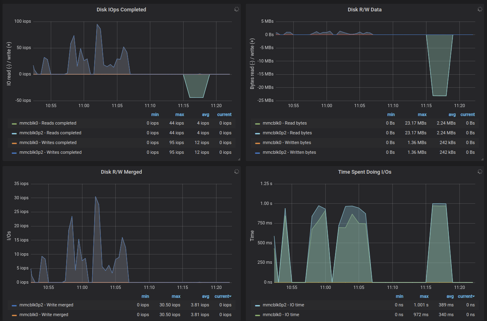
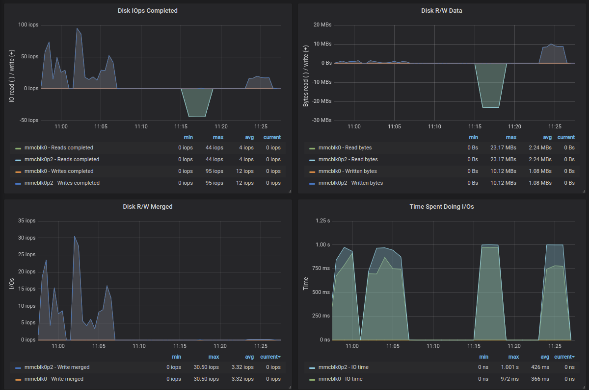
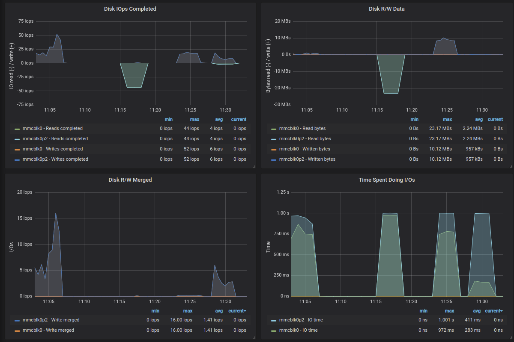
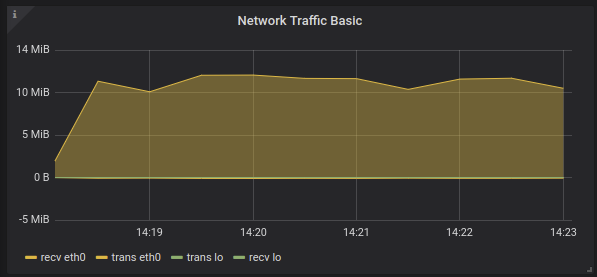

## Install monitoring

I intend to use mysql to store the temperature data, which would be a no-brainer choise 10 years ago. Now we have more options in that area, but let's first try to do it in relational database like mysql.

Nice links:
- Graphing MySQL performance with Prometheus and Grafana https://www.percona.com/blog/2016/02/29/graphing-mysql-performance-with-prometheus-and-grafana/
- Monitoring – How to install Prometheus/Grafana on arm – Raspberry PI/Rock64 https://www.mytinydc.com/index.php/en/2019/04/14/monitoring-how-to-install-prometheus-grafana-on-arm-raspberry-pi-rock64-client-server/

Node exporter installation
```
# cd /opt
# wget https://github.com/prometheus/node_exporter/releases/download/v0.18.1/node_exporter-0.18.1.linux-armv7.tar.gz
# md5sum node_exporter-0.18.1.linux-armv7.tar.gz
f9b28f4bfeecc4fe17b441098117359c  node_exporter-0.18.1.linux-armv7.tar.gz
# tar xvzf node_exporter-0.18.1.linux-armv7.tar.gz
# cd /opt
# ln -s node_exporter-0.18.1.linux-armv7 node_exporter

or for Raspberry Pi 1
# cd /opt
# wget https://github.com/prometheus/node_exporter/releases/download/v0.18.1/node_exporter-0.18.1.linux-armv6.tar.gz
# md5sum node_exporter-0.18.1.linux-armv6.tar.gz 
83611c07f3728175b81f3631df12eba8  node_exporter-0.18.1.linux-armv6.tar.gz
# tar xvzf node_exporter-0.18.1.linux-armv6.tar.gz
# cd /opt
# ln -s node_exporter-0.18.1.linux-armv6 node_exporter
```


Make node_exporter to autostart on system boot
```
# vi /lib/systemd/system/node_exporter.service
[Unit]
Description=Prometheus Node Exporter
After=multi-user.target

[Service]
Type=idle
WorkingDirectory=/opt/node_exporter
ExecStart=/opt/node_exporter/node_exporter
Restart=on-failure

[Install]
WantedBy=multi-user.target

# chmod 644 /lib/systemd/system/node_exporter.service
# systemctl daemon-reload
# systemctl enable node_exporter.service
# systemctl start node_exporter.service
# systemctl status node_exporter.service
```
http://monitoring:9100/metrics
-> you should see lot's of metrics

Prometheus server installation
```
# cd /opt
# wget https://github.com/prometheus/prometheus/releases/download/v2.11.1/prometheus-2.11.1.linux-armv7.tar.gz
# md5sum prometheus-2.11.1.linux-armv7.tar.gz
24c11873082f6c6be172b25e5b365576  prometheus-2.11.1.linux-armv7.tar.gz
# tar xvzf prometheus-2.11.1.linux-armv7.tar.gz
# cd prometheus-2.11.1.linux-armv7
# cp prometheus.yml prometheus.yml_`date -I`
# vi prometheus.yml
(does it make sense?)
# nohup ./prometheus &
# cd /opt
# ln -s prometheus-2.11.1.linux-armv7 prometheus

```
http://monitoring:9090/targets

Make Prometheus server to autostart on system boot
```
# vi /lib/systemd/system/prometheus.service
[Unit]
Description=Prometheus server
After=multi-user.target

[Service]
Type=idle
WorkingDirectory=/opt/prometheus
ExecStart=/opt/prometheus/prometheus
Restart=on-failure

[Install]
WantedBy=multi-user.target

# chmod 644 /lib/systemd/system/prometheus.service
# systemctl daemon-reload
# systemctl enable prometheus.service
# systemctl start prometheus.service
# systemctl status prometheus.service
```

To reload the new configuration, if we ever want to change it do it with
```
# systemctl restart prometheus.service
```

Grafana server installation

```
# cd /opt
# wget https://dl.grafana.com/oss/release/grafana_6.2.5_armhf.deb 
# dpkg -i grafana_6.2.5_armhf.deb 
(that will most likely fail because of some missing prerequisites, install them - and finish grafana installation - with the next command)
# apt -f install
# /bin/systemctl daemon-reload
# /bin/systemctl enable grafana-server
# /bin/systemctl start grafana-server
```
(wait 2min)
http://monitoring:3000
login as admin/admin

Go to 'Add data source'
-> Prometheus
-> http://192.168.1.20:9090
(Save & Test)

Import dashboard
(big plus sign) -> Import 
Grafana.com Dashboard: https://grafana.com/dashboards/1860
Prometheus -> Prometheus
-> Import

Add a client to the monitoring system

Now, we are monitoring the monitoring host with our monitoring solution, which is nice, but we would like to monitor other hosts as well. 

On every node that needs to be monitored we need to:
- install 'Node exporter' as above
- add new host to Prometheus configuration and restart it

## Benchmark

Nice links:
- https://askubuntu.com/questions/87035/how-to-check-hard-disk-performance

First let's establish some hardware limits on the Raspberry Pis I will use. That will let us to see the bottlenecks.

```
# apt install -y sysbench nmon fio
# cd /opt
```

### CPU test
```
# sysbench --test=cpu --num-threads=4 --cpu-max-prime=20000 run
```


### IO Test

Nice links:
- https://askubuntu.com/questions/87035/how-to-check-hard-disk-performance
- https://devconnected.com/monitoring-disk-i-o-on-linux-with-the-node-exporter/
- https://www.robustperception.io/mapping-iostat-to-the-node-exporters-node_disk_-metrics


Sequential READ 

    # fio --name TEST --eta-newline=5s --filename=fio-tempfile.dat --rw=read --size=1500m --io_size=10g --blocksize=1024k --ioengine=libaio --fsync=10000 --iodepth=32 --direct=1 --numjobs=1 --runtime=180 --group_reporting
    read: IOPS=22, BW=22.1MiB/s (23.1MB/s)(4004MiB/181433msec)
    iops        : min=    2, max=   70, avg=22.16, stdev= 3.70, samples=357




Sequential WRITE

    # fio --name TEST --eta-newline=5s --filename=fio-tempfile.dat --rw=write --size=1500m --io_size=10g --blocksize=1024k --ioengine=libaio --fsync=10000 --iodepth=32 --direct=1 --numjobs=1 --runtime=180 --group_reporting
    write: IOPS=8, BW=9205KiB/s (9426kB/s)(1622MiB/180437msec); 0 zone resets
    iops        : min=    2, max=   72, avg=20.68, stdev=23.77, samples=153




Mixed random 4K read and write QD1 with sync

    # fio --name TEST --eta-newline=5s --filename=fio-tempfile.dat --rw=randrw --size=1500m --io_size=10g --blocksize=4k --ioengine=libaio --fsync=1 --iodepth=1 --direct=1 --numjobs=1 --runtime=180 --group_reporting
    read: IOPS=3, BW=12.0KiB/s (12.3kB/s)(2172KiB/180296msec)
    write: IOPS=3, BW=13.1KiB/s (13.4kB/s)(2360KiB/180296msec); 0 zone resets
    iops        : min=    2, max=   18, avg= 7.80, stdev= 3.87, samples=150

(all before can be seen here)



What is important from this test is that we can max out our SD card performance in two different ways. First is a sequential throuput, where we can read around 20MB/s or write 10MB/s. Second is the number of random IO that can happen, and it is actually very poor with this SD card and can go up to around 30IOPS.

The point is to be able to say that our IO subsystem is the bottleneck. 

One certain way to say that we are suffering from IO bottleneck is to look at 'Time Spent Doing I/Os' metric, where when it reaches 1s it means that for 1s all the system was doing was waiting 1s for IO. It is kind of weird, and probably something like %IO utilisation would be better here, but if we tread it like in 1s I was doing IO for 1s then it is clear that IO it all that is happening.


### Network test

    $ scp oko4.img pi@mysql:

I know that there some CPU overhead associated with scp, but in general it should show the expected performance.

|         | RPi 2 Model B V1.1 |
|---------|--------------------|
| ingress | up to 9MB/s        |

Now, as our SD card write performance is similar, it may be that I am seeing disk performance.

    $ scp oko4.img pi@mysql:/dev/null

Ok, this one does not cause any IO activity, so we are just measuring network throughput and a bit of CPU.

|         | RPi 2 Model B V1.1 |
|---------|--------------------|
| ingress | up to 11MB/s       |



According to https://www.raspberrypi.org/products/raspberry-pi-2-model-b/
tested Raspberry Pi 2 Model B has 100 Base Ethernet, which is around what we see


