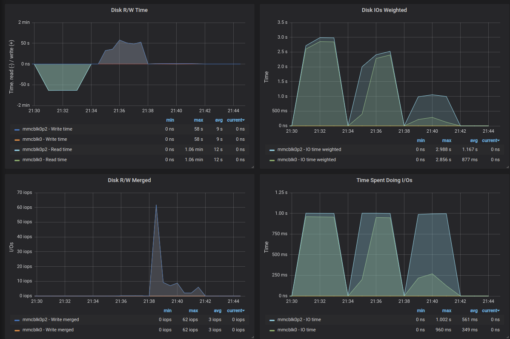

## Install mysql + datamodel

Install MariaDB which is a MySQL spin-off after it was purchased by Oracle.

```
# apt-get install -y mariadb-server
# mysql -u root 
> create database temperature;
CREATE TABLE temperature.reading (
    reading_location VARCHAR(20),
    reading_date date,
    reading_note VARCHAR(20),
    reading_value float
);
> create user remik;
> grant all on temperature.* to 'remik'@'%' identified by 'remik';

Listen on all interfaces
# vi /etc/mysql/mariadb.conf.d/50-server.cnf
bind-address = 0.0.0.0
# systemctl restart mariadb
```

Setting up mysql metrics for Prometheus. 

Nice links:
- https://www.percona.com/blog/2016/02/29/graphing-mysql-performance-with-prometheus-and-grafana/

```
# cd /opt
# wget https://github.com/prometheus/mysqld_exporter/releases/download/v0.12.0/mysqld_exporter-0.12.0.linux-armv7.tar.gz
# md5sum mysqld_exporter-0.12.0.linux-armv7.tar.gz 
36190ef34fe21f7c0bb4266567f3e19d  mysqld_exporter-0.12.0.linux-armv7.tar.gz
# tar xvzf mysqld_exporter-0.12.0.linux-armv7.tar.gz
# ln -s mysqld_exporter-0.12.0.linux-armv7 mysqld_exporter
```

mysqld_exporter wants MySQL credentials.
```
# mysql -u root 
> GRANT REPLICATION CLIENT, PROCESS ON *.* TO 'prom'@'localhost' identified by 'secret';
> GRANT SELECT ON performance_schema.* TO 'prom'@'localhost';
# cd /opt/mysqld_exporter
# cat << EOF > .my.cnf
[client]
user=prom
password=secret
EOF
# ./mysqld_exporter --config.my-cnf=".my.cnf"
```

Now it should be visible under port 9104

http://mysql:9104

Make mysqld_exporter to autostart on system boot
```
# vi /lib/systemd/system/mysqld_exporter.service
[Unit]
Description=Prometheus Mysqld Exporter
After=multi-user.target

[Service]
Type=idle
WorkingDirectory=/opt/mysqld_exporter
ExecStart=/opt/mysqld_exporter/mysqld_exporter --config.my-cnf=".my.cnf"
Restart=on-failure

[Install]
WantedBy=multi-user.target

# chmod 644 /lib/systemd/system/mysqld_exporter.service
# systemctl daemon-reload
# systemctl enable mysqld_exporter.service
# systemctl start mysqld_exporter.service
# systemctl status mysqld_exporter.service
```

Add another target and job to Prometheus
```
# cd /opt/prometheus
# vi prometheus.yml
- job_name: mysql
    static_configs:
      - targets: ['192.168.1.90:9104']
        labels:
          alias: mysql1

```

Import dashboard to Grafana
(big plus sign) -> Import 
Grafana.com Dashboard: 7362
(for example I picked https://grafana.com/grafana/dashboards/7362 but browse through them to pick the one you like)


# Producers

## Crazy Temperature producer

Let's create a producer that will provide a lot of data, that would mimic heavy load. For lack of better idea that will be CPU temperature.

Just to 

```
$ ssh -l pi producer1
$ sudo apt-get update
$ sudo apt install -y subversion python-pip build-essential python-dev git python-rpi.gpio python-dateutil
$ sudo python -m pip install mysql-connector
$ cd
$ svn checkout https://github.com/rbogusze/oracleinfrastructure/trunk/scripto
$ cd scripto/python/temperature/

```

# Mysql

## One producer + mysql


| Producers | Consumers | Misc       |
|-----------|-----------|------------|
| producer1 | mysql     | monitoring |


Ok, first let's just see how many transactions per second (TPS) we can get from one really old Raspberry Pi 1 that is writing temperature readings into RDBMS mysql running on Raspberry Pi 2 and see where the bottleneck is.

On producer1
```
$ cd ~/scripto/python/temperature
```

Make sure we are using only mysql backend and that we are not introducing any sleep between the temperature readings
```
$ vi collect.py
backend_mysql = True
backend_cassandra = False
backend_kafka = False

sleep_time = 0 #in seconds
mysql_commit_frequency = 0
```

Let's run the script, it should print the TPS ratings
```
$ python collect.py
INFO - TPS: 19 Average TPS: 12
```

And let's look what is the bottleneck now.

Producer seems to be fine, 10% CPU, no IOs.

Mysql server on the other hand seems to suffer from IO.

Checking Grafana Node, Disk Detail section


So far we can handle on average 12 TPS and mysql IO subsystem is the bottleneck. We could try to improve that by upgrading to a better/faster SD card but first let's understand why this is happening.

The way this simple producer is written is that after every insert into the table a commit is issued. In RDBMS like mysql commit is a pretty expensive operation in terms of IO, as the database has be sure that data is permanently written to disk before returning a confirmation to the client that the commit succeeded.

This is something that usually is a business decision, when to commit, but in this simple situation it really does not matter that much if we lose some data in case of system crash.

Let's allow the producer to commit less frequently. I have prepared the script with a parameter that controls how often commit is requested.

First let's commit every 10th insert and see what happens.

```
$ vi collect.py
mysql_commit_frequency = 10
```

| mysql_commit_frequency | avg TPS |
|------------------------|---------|
| 0 (every row)          | 12      |
| 10 (every 10th row)    | 24      |


That has improved the throuput a lot, now we can do 24 TPS, producer has 25% CPU utilisation and the bottleneck is still mysql IO performance.

Let's bump it up again and keep it bumping up and see what is happening.

```
$ vi collect.py
mysql_commit_frequency = 100
```

| mysql_commit_frequency | avg TPS | producer CPU   | bottleneck             |
|------------------------|---------|----------------|------------------------|
| 0 (every row)          | 12      | 10             | mysql IO               |
| 10 (every 10th row)    | 24      | 25             | mysql IO               |
| 100                    | 44      | 25             | mysql IO               |
| 1000                   | 115     | 75 (sometimes) | producer1 CPU/mysql IO |
| 10000                  | 107     | 75 (sometimes) | producer1 CPU/mysql IO |

Ok, so we reached a point when if there is no IO bottlenect on mysql site then producer1 is doing around 170TPS and that is maxing out the producer1's CPU capability. When there is IO issue the producer's CPU drops to 25% and is making 60TPS. The average is as above in table, and we can see the bottleneck moving between producer1 and mysql.

Anyway I am pretty disapointed with the IO performance of the SD card I am currently using. This is common Kingston C4 card. Let's try with something different, namely Samsung EVO Plus. 


## mysql with Samsung SD cards

### IO performance tests repeated
Sequential READ 

	read: IOPS=22, BW=22.2MiB/s (23.3MB/s)(4028MiB/181441msec)
	iops        : min=    2, max=   82, avg=22.24, stdev= 4.55, samples=357


Sequential WRITE

	write: IOPS=16, BW=16.7MiB/s (17.5MB/s)(3040MiB/182247msec); 0 zone resets
	iops        : min=    1, max=   78, avg=22.90, stdev=19.83, samples=261


Mixed random 4K read and write QD1 with sync

	read: IOPS=13, BW=53.6KiB/s (54.8kB/s)(9652KiB/180223msec)
	write: IOPS=13, BW=55.9KiB/s (57.2kB/s)(9.83MiB/180223msec); 0 zone resets
	iops        : min=    1, max=  160, avg=24.44, stdev=33.71, samples=205


Three tests one after another to see where is the common



-> whenever I see there 'Time Spent Doing IOs' reaches 1s it means we have an IO bottleneck.


Comparing IO performance

|                       | Kingston               | Samsung SD card              |
|-----------------------|------------------------|------------------------------|
| Sequential READ       | IOPS=22, BW=22.1MiB/s  | IOPS=22, BW=22.2MiB/s        |
| Sequential READ IO    | max=70 avg=22 stdev=3  | max=82 avg=22.24 stdev=4.55  |
| Sequential WRITE      | IOPS=8, BW=9205KiB/s   | IOPS=16, BW=16.7MiB/s        |
| Sequential WRITE IO   | max=72 avg=20 stdev=23 | max=78 avg=22.90 stdev=19.83 |
| Random 4K read QD1    | IOPS=1080, BW=4321KiB  | IOPS=1371, BW=5484KiB/s      |
| Random 4K read QD1 IO | max= 1184, avg=1079.97 | max= 1540, avg=1370.62       |
| Mixed random 4K READ  | IOPS=3, BW=12.0KiB/s   | IOPS=13, BW=53.6KiB/s        |
| Mixed random 4K WRITE | IOPS=3, BW=13.1KiB/s   | IOPS=13, BW=55.9KiB/s        |
| Mixed random 4K IO    | max=18 avg=7 stdev=3.8 | max=160 avg=24.44 stdev=33.7 |

Conclusion: All the tests seem more or less equal except the most important one, which is 'Mixed random 4K' as this one does waht usually happens in system with RDBMS Database - a mix of random and sequential IO. With Samsung we have around 4 x better results. 

Let's see if our tests with producer confirm that findings.


### One producer + mysql test repeated

| mysql_commit_frequency | King TPS | Sams TPS | prod CPU   | bottleneck |
|------------------------|----------|----------|------------|------------|
| 0 (every row)          | 12       | 32       | 30         | mysql IO   |
| 10 (every 10th row)    | 24       | 138      | 73 (const) | ?          |
| 100                    | 44       | 162      | 83 (const) | producer1  |
| 1000                   | 115      | 166      | 85 (const) | producer1  |
| 10000                  | 107      | 171      | 85 (const) | producer1  |

Nice, this gives us pretty stable 160 TPS and finally it looks like the bottleneck moved to producer, as we are hitting around 80-90% CPU utilisation while at the mysql site the metric 'Time Spent Doing I/Os' is below 40ms, which means that the host is not IO bound. 

This is nicely visible in:


Every decrease in the commint frequency causes less load on the IO subsystem.

IO still does happen on the mysql server, but we are not forcing a disk sync at every commit, and as a result do not stress it that much.

Conclusion: We started with 32 TPS with commit at every insert and up to 170 TPS with no commit at all. As it hardly resembles reality it gives us an overview of what is possible with current setup. 

We reached a point where the test is hindered by a weak client, that is unable to produce any more data let's add another one.


## Two producers -> mysql


| Producers | Consumers | Misc       |
|-----------|-----------|------------|
| producer1 | mysql     | monitoring |
| producer2 |           |            |

Configure the producer2 as producer1:
- install prometheus node exporter as above
- checkout scripto directory that contains producer script collect.py as above

There is no point to test it from both producers with commit after every insert as we have already determined this is causing IO isuues on mysql site. let's start with every 10th row.

Actually let's execute twice the producer's scripts, that way we can really use all CPU on producers.


| mysql_commit_frequency | TPS | mysql             | prod    | bottleneck |
|------------------------|-----|-------------------|---------|------------|
| 10 (every 10th row)    | 393 | CPU 24%, 300ms IO | 94% CPU | prod       |
| 100                    | 399 | CPU 17%, 110ms IO | 98% CPU | prod       |
| 1000                   | 401 | CPU 16%, 80ms IO  | 98% CPU | prod       |

In general again as long as we do not commit every insert the IO load on the mysql consumer is within capacity and we max out producer's CPU.

Looks like it is time to add another producer. It will be again very old Raspberry Pi 1 from 2011 as I have lot's of them laying around.


## Three producers -> mysql


| Producers | Consumers | Misc       |
|-----------|-----------|------------|
| producer1 | mysql     | monitoring |
| producer2 |           |            |
| producer3 |           |            |

Now I am launching twice the same stress script from each producer, this gives me nice almost 100% CPU utilisation on them despite the fact that those poor Pi's have only one CPU.

| mysql_commit_frequency | TPS | mysql             | prod    | bottleneck |
| 10 (every 10th row)    | 593 | CPU 32%, 500ms IO | 91% CPU | prod       |
| 100                    | 600 | CPU 24%, 100ms IO | 98% CPU | prod       |
| 1000                   | 593 | CPU 22%, 60ms IO  | 99% CPU | prod       |

That 600TPS is pretty sweet score already, but it looks like we need more producers to really hammer this mysql instance.

## Introducing Fourth producer


| Producers | Consumers | Misc       |
|-----------|-----------|------------|
| producer1 | mysql     | monitoring |
| producer2 |           |            |
| producer3 |           |            |
| producer4 |           |            |

I have run out of Raspberry Pi 1, time to pick up something more powerful. RPi2mB is the one that will produce as well.

Testing with just one collect script:

    mysql_commit_frequency = 10
    $ python collect.py
	
That is a change visible already, as previously one `collect.py` script was able to create 138TPS with 73% CPU utilized, this time I can see the producer average of 235TPS and that is causing 11% CPU busy. Nice, as this Pi 2 has 4 CPUs we can expect a nice performance boost.

It has been noted previously that even with RPi1, which has 1 CPU it is beneficial to execute 2 producer scripts, as this really fully uses the available CPU. With 4 CPUs we would have to execute 8 collect.py scripts, so it is time to automate it a bit and create a wrapper around `$ python collect.py` - this is `multi_collect.sh` bash script that will spawn two `collect.py` scripts for every CPU thread it finds on the host.

That way just running one script we fully make use of the producer's CPU. So, again.

    mysql_commit_frequency = 10
    $ ./multi_collect.sh

That alone stresses the IO on mysql site, even with `mysql_commit_frequency = 10` but gives us incredible 1500TPS.

| mysql_commit_frequency | TPS  | consumer          | producer4 | bottleneck |
|------------------------|------|-------------------|-----------|------------|
| 10                     | 1500 | CPU 60%, IO 800ms | CPU 68%   | consumer   |
| 100                    | 1700 | CPU 56%, IO 300ms | CPU 88%   | producer   |
| 1000                   | 1850 | CPU 52%, IO 109ms | CPU 92%   | producer   |

And this is all from one producer. Actually we reached another milestone, where the mysql consumer is unable to sustain the IO load with a commit every 10 inserts. To be able to increase the rate producers are issuing the inserts we needed to introduce even longer breaks with the commit frequency. Let's see how far we can go with all producers.

| mysql_commit_frequency | TPS  | consumer          | producer1-4 | bottleneck |
|------------------------|------|-------------------|-------------|------------|
| 100                    | 2150 | CPU 71%, IO 375ms | CPU 77-83%  | producer   |
| 1000                   | 2260 | CPU 68%, IO 166ms | CPU 85-97%  | producer   |


Ok, we are getting closer to utilise another resource on consumer side, namely CPU. Anyway commiting every 100th row is serious compromise, but could be valid in many IOT systems. I am honestly impressed how well mysql handles small inserts.


## Replacing Third producer


Looks like I need more power on the producers. To limit the number of them I will replace on RPi 1 with RPi 2 which is at least 4 times more powerfull in terms of CPU.

    mysql_commit_frequency = 100
    $ ./multi_collect.sh
	
| commit_fr | TPS       | consumer          | producer1-4 | bottleneck      |
|-----------|-----------|-------------------|-------------|-----------------|
| 100       | 1500-2500 | CPU 89%, IO 500ms | CPU 62%     | consumer CPU+IO |
| 1000      | 2840      | CPU 90%, IO 233ms | CPU 70%     | consumer CPU    |

That is it. We are able to make consumer mysql to reach its capabilities both at:
1. IO subsystem - actually we were able to do this very early when we commit every insert with only one producer, but with all producers and commit every 100rows we finally reach to the point where IO wait time is substantial and can be considered as bottleneck. 
2. CPU - even with commit every 1000 rows, where IO is not substantially stressed we reach 90% CPU utilisation while producers are at 70%.

What could be done if we want to scale more? That is the main issue with RDBMS database, that they basically scale well only vertically so we could buy better storage and bigger server but there is a limit to that. At some point the bigger/faster storage/server is very expensive and we have a problem.

Anyway it is a great score, let's see how other databases can deal with such a task.

