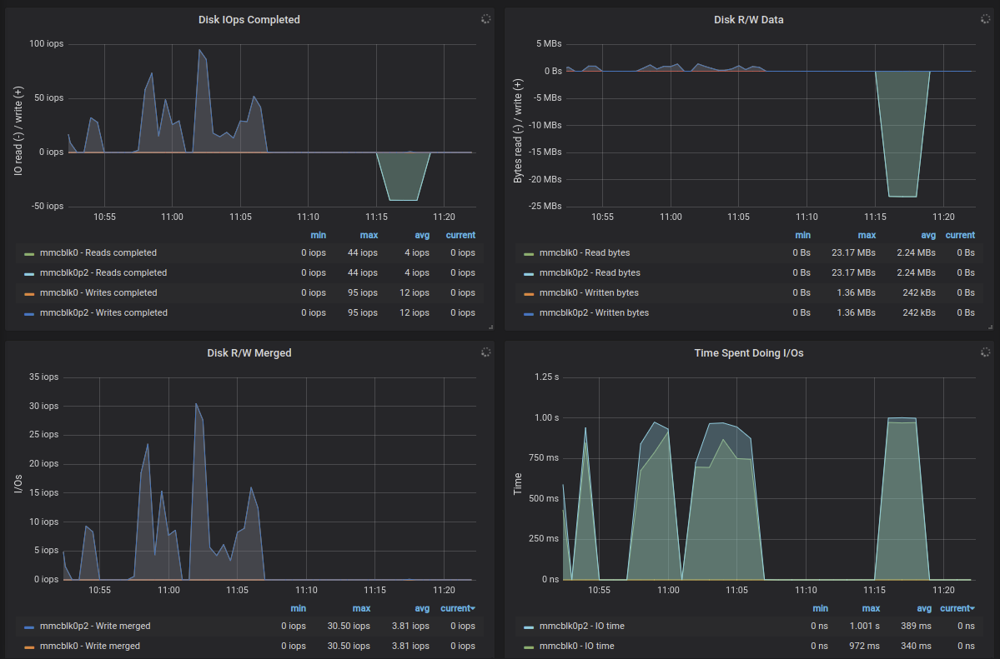
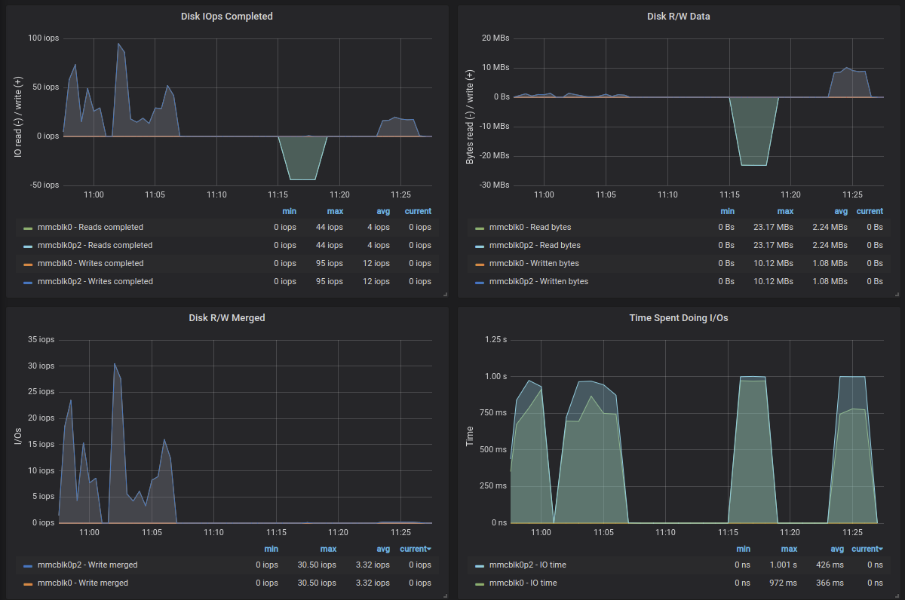
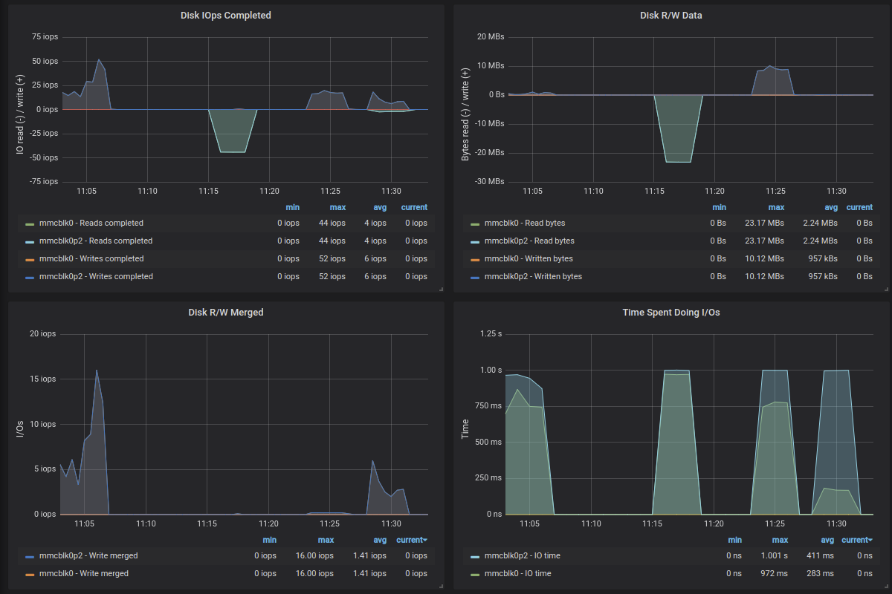
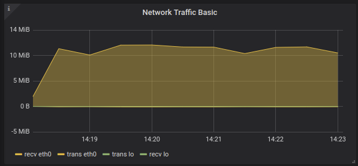

# (WIP) Motivation and roadmap

Gathering information like temperature is a perfect case to have a lot of fun with, use different technologies just to see if they fit the picture well and provide something that is cool to watch.

I can see the scenario as follows:
1. gather CPU temperature that is already available in Raspberry Pi
2. store it in old good RDBMS MySQL
3. store it in Cassandra database that was already used in [Stock LCD display](docs/stock_lcd_display.md)
4. store it in Kafka, as messagin system like that is perfect for such job and it is just a beatiful concept to decouple producers of data from consumers of data
5. store it in old good RDBMS MySQL, but this time the script that gathers the temperature will not even know about that - we will use Kafka for that, as the data is already there
6. display it on Grafana, just to have a nice view

Even more fun with data
1. configure Kafka to store the data "since the beginning" which will allow us to build external systems for analysis like Hadoop
2. play with Kafka and see how we can make it break/fix/scale

# First things first

## Install monitoring

I intend to use mysql to store the temperature data, which would be a no-brainer choise 10 years ago. Now we have more options in that area, but let's first try to do it in relational database like mysql.

Nice links:
- Graphing MySQL performance with Prometheus and Grafana https://www.percona.com/blog/2016/02/29/graphing-mysql-performance-with-prometheus-and-grafana/
- Monitoring – How to install Prometheus/Grafana on arm – Raspberry PI/Rock64 https://www.mytinydc.com/index.php/en/2019/04/14/monitoring-how-to-install-prometheus-grafana-on-arm-raspberry-pi-rock64-client-server/

Node exporter installation
```
# cd /opt
# wget https://github.com/prometheus/node_exporter/releases/download/v0.18.1/node_exporter-0.18.1.linux-armv7.tar.gz
# md5sum node_exporter-0.18.1.linux-armv7.tar.gz
f9b28f4bfeecc4fe17b441098117359c  node_exporter-0.18.1.linux-armv7.tar.gz
# tar xvzf node_exporter-0.18.1.linux-armv7.tar.gz
# cd /opt
# ln -s node_exporter-0.18.1.linux-armv7 node_exporter

or for Raspberry Pi 1
# cd /opt
# wget https://github.com/prometheus/node_exporter/releases/download/v0.18.1/node_exporter-0.18.1.linux-armv6.tar.gz
# md5sum node_exporter-0.18.1.linux-armv6.tar.gz 
83611c07f3728175b81f3631df12eba8  node_exporter-0.18.1.linux-armv6.tar.gz
# tar xvzf node_exporter-0.18.1.linux-armv6.tar.gz
# cd /opt
# ln -s node_exporter-0.18.1.linux-armv6 node_exporter
```


Make node_exporter to autostart on system boot
```
# vi /lib/systemd/system/node_exporter.service
[Unit]
Description=Prometheus Node Exporter
After=multi-user.target

[Service]
Type=idle
WorkingDirectory=/opt/node_exporter
ExecStart=/opt/node_exporter/node_exporter
Restart=on-failure

[Install]
WantedBy=multi-user.target

# chmod 644 /lib/systemd/system/node_exporter.service
# systemctl daemon-reload
# systemctl enable node_exporter.service
# systemctl start node_exporter.service
# systemctl status node_exporter.service
```
http://monitoring:9100/metrics
-> you should see lot's of metrics

Prometheus server installation
```
# cd /opt
# wget https://github.com/prometheus/prometheus/releases/download/v2.11.1/prometheus-2.11.1.linux-armv7.tar.gz
# md5sum prometheus-2.11.1.linux-armv7.tar.gz
24c11873082f6c6be172b25e5b365576  prometheus-2.11.1.linux-armv7.tar.gz
# tar xvzf prometheus-2.11.1.linux-armv7.tar.gz
# cd prometheus-2.11.1.linux-armv7
# cp prometheus.yml prometheus.yml_`date -I`
# vi prometheus.yml
(does it make sense?)
# nohup ./prometheus &
# cd /opt
# ln -s prometheus-2.11.1.linux-armv7 prometheus

```
http://monitoring:9090/targets

Make Prometheus server to autostart on system boot
```
# vi /lib/systemd/system/prometheus.service
[Unit]
Description=Prometheus server
After=multi-user.target

[Service]
Type=idle
WorkingDirectory=/opt/prometheus
ExecStart=/opt/prometheus/prometheus
Restart=on-failure

[Install]
WantedBy=multi-user.target

# chmod 644 /lib/systemd/system/prometheus.service
# systemctl daemon-reload
# systemctl enable prometheus.service
# systemctl start prometheus.service
# systemctl status prometheus.service
```

To reload the new configuration, if we ever want to change it do it with
```
# systemctl restart prometheus.service
```

Grafana server installation

```
# cd /opt
# wget https://dl.grafana.com/oss/release/grafana_6.2.5_armhf.deb 
# dpkg -i grafana_6.2.5_armhf.deb 
(that will most likely fail because of some missing prerequisites, install them - and finish grafana installation - with the next command)
# apt -f install
# /bin/systemctl daemon-reload
# /bin/systemctl enable grafana-server
# /bin/systemctl start grafana-server
```
(wait 2min)
http://monitoring:3000
login as admin/admin

Go to 'Add data source'
-> Prometheus
-> http://192.168.1.20:9090
(Save & Test)

Import dashboard
(big plus sign) -> Import 
Grafana.com Dashboard: https://grafana.com/dashboards/1860
Prometheus -> Prometheus
-> Import

Add a client to the monitoring system

Now, we are monitoring the monitoring host with our monitoring solution, which is nice, but we would like to monitor other hosts as well. 

On every node that needs to be monitored we need to:
- install 'Node exporter' as above
- add new host to Prometheus configuration and restart it

## Benchmark

Nice links:
- https://askubuntu.com/questions/87035/how-to-check-hard-disk-performance
- 

First let's establish some hardware limits on the Raspberry Pis I will use. That will let us to see the bottlenecks.

```
# apt install -y sysbench nmon fio
# cd /opt
```

### CPU test
```
# sysbench --test=cpu --num-threads=4 --cpu-max-prime=20000 run
```


### IO Test

Nice links:
- https://askubuntu.com/questions/87035/how-to-check-hard-disk-performance
- https://devconnected.com/monitoring-disk-i-o-on-linux-with-the-node-exporter/
- https://www.robustperception.io/mapping-iostat-to-the-node-exporters-node_disk_-metrics


Sequential READ 

    # fio --name TEST --eta-newline=5s --filename=fio-tempfile.dat --rw=read --size=1500m --io_size=10g --blocksize=1024k --ioengine=libaio --fsync=10000 --iodepth=32 --direct=1 --numjobs=1 --runtime=180 --group_reporting
    read: IOPS=22, BW=22.1MiB/s (23.1MB/s)(4004MiB/181433msec)
    iops        : min=    2, max=   70, avg=22.16, stdev= 3.70, samples=357




Sequential WRITE

    # fio --name TEST --eta-newline=5s --filename=fio-tempfile.dat --rw=write --size=1500m --io_size=10g --blocksize=1024k --ioengine=libaio --fsync=10000 --iodepth=32 --direct=1 --numjobs=1 --runtime=180 --group_reporting
    write: IOPS=8, BW=9205KiB/s (9426kB/s)(1622MiB/180437msec); 0 zone resets
    iops        : min=    2, max=   72, avg=20.68, stdev=23.77, samples=153




Mixed random 4K read and write QD1 with sync

    # fio --name TEST --eta-newline=5s --filename=fio-tempfile.dat --rw=randrw --size=1500m --io_size=10g --blocksize=4k --ioengine=libaio --fsync=1 --iodepth=1 --direct=1 --numjobs=1 --runtime=180 --group_reporting
    read: IOPS=3, BW=12.0KiB/s (12.3kB/s)(2172KiB/180296msec)
    write: IOPS=3, BW=13.1KiB/s (13.4kB/s)(2360KiB/180296msec); 0 zone resets
    iops        : min=    2, max=   18, avg= 7.80, stdev= 3.87, samples=150

(all before can be seen here)



What is important from this test is that we can max out our SD card performance in two different ways. First is a sequential throuput, where we can read around 20MB/s or write 10MB/s. Second is the number of random IO that can happen, and it is actually very poor with this SD card and can go up to around 30IOPS.

The point is to be able to say that our IO subsystem is the bottleneck. 

One certain way to say that we are suffering from IO bottleneck is to look at 'Time Spent Doing I/Os' metric, where when it reaches 1s it means that for 1s all the system was doing was waiting 1s for IO. It is kind of weird, and probably something like %IO utilisation would be better here, but if we tread it like in 1s I was doing IO for 1s then it is clear that IO it all that is happening.


### Network test

    $ scp oko4.img pi@mysql:

I know that there some CPU overhead associated with scp, but in general it should show the expected performance.

|         | RPi 2 Model B V1.1 |
| ingress | up to 9MB/s       |

Now, as our SD card write performance is similar, it may be that I am seeing disk performance.

    $ scp oko4.img pi@mysql:/dev/null

Ok, this one does not cause any IO activity, so we are just measuring network throughput and a bit of CPU.

|         | RPi 2 Model B V1.1 |
| ingress | up to 11MB/s       |



According to https://www.raspberrypi.org/products/raspberry-pi-2-model-b/
tested Raspberry Pi 2 Model B has 100 Base Ethernet, which is around what we see


## Install mysql + datamodel

```
# apt-get install -y mariadb-server
# mysql -u root 
> create database temperature;
CREATE TABLE temperature.reading (
    reading_location VARCHAR(20),
    reading_date date,
    reading_note VARCHAR(20),
    reading_value float
);
> create user remik;
> grant all on temperature.* to 'remik'@'%' identified by 'remik';

Listen on all interfaces
# vi /etc/mysql/mariadb.conf.d/50-server.cnf
bind-address = 0.0.0.0
# systemctl restart mariadb
```

Setting up mysql metrics for Prometheus. 

Nice links:
- https://www.percona.com/blog/2016/02/29/graphing-mysql-performance-with-prometheus-and-grafana/

```
# cd /opt
# wget https://github.com/prometheus/mysqld_exporter/releases/download/v0.12.0/mysqld_exporter-0.12.0.linux-armv7.tar.gz
# md5sum mysqld_exporter-0.12.0.linux-armv7.tar.gz 
36190ef34fe21f7c0bb4266567f3e19d  mysqld_exporter-0.12.0.linux-armv7.tar.gz
# tar xvzf mysqld_exporter-0.12.0.linux-armv7.tar.gz
# ln -s mysqld_exporter-0.12.0.linux-armv7 mysqld_exporter
```

mysqld_exporter wants MySQL credentials.
```
# mysql -u root 
> GRANT REPLICATION CLIENT, PROCESS ON *.* TO 'prom'@'localhost' identified by 'secret';
> GRANT SELECT ON performance_schema.* TO 'prom'@'localhost';
# cd /opt/mysqld_exporter
# cat << EOF > .my.cnf
[client]
user=prom
password=secret
EOF
# ./mysqld_exporter --config.my-cnf=".my.cnf"
```

http://192.168.1.90:9104

Make mysqld_exporter to autostart on system boot
```
# vi /lib/systemd/system/mysqld_exporter.service
[Unit]
Description=Prometheus Mysqld Exporter
After=multi-user.target

[Service]
Type=idle
WorkingDirectory=/opt/mysqld_exporter
ExecStart=/opt/mysqld_exporter/mysqld_exporter --config.my-cnf=".my.cnf"
Restart=on-failure

[Install]
WantedBy=multi-user.target

# chmod 644 /lib/systemd/system/mysqld_exporter.service
# systemctl daemon-reload
# systemctl enable mysqld_exporter.service
# systemctl start mysqld_exporter.service
# systemctl status mysqld_exporter.service
```

Add another target and job to Prometheus
```
# cd /opt/prometheus
# vi prometheus.yml
- job_name: mysql
    static_configs:
      - targets: ['192.168.1.90:9104']
        labels:
          alias: mysql1

```

Import dashboard to Grafana
(big plus sign) -> Import 
Grafana.com Dashboard: 7362
(for example I picked https://grafana.com/grafana/dashboards/7362 but browse through them to pick the one you like)


# Producers

## Crazy Temperature producer

Let's create a producer that will provide a lot of data, that would mimic heavy load. For lack of better idea that will be CPU temperature.

Just to 

```
$ ssh -l pi producer1
$ sudo apt-get update
$ sudo apt install -y subversion python-pip build-essential python-dev git python-rpi.gpio python-dateutil
$ sudo python -m pip install mysql-connector
$ cd
$ svn checkout https://github.com/rbogusze/oracleinfrastructure/trunk/scripto
$ cd scripto/python/temperature/

```

# Mysql

## One producer + mysql

'2019-07-25 16.53.02.jpg'

Ok, first let's just see how many transactions per second (TPS) we can get from one really old Raspberry Pi 1 that is writing temperature readings into RDBMS mysql running on Raspberry Pi 2 and see where the bottleneck is.

On producer1
```
$ cd ~/scripto/python/temperature
```

Make sure we are using only mysql backend and that we are not introducing any sleep between the temperature readings
```
$ vi collect.py
backend_mysql = True
backend_cassandra = False
backend_kafka = False

sleep_time = 0 #in seconds
mysql_commit_frequency = 0
```

Let's run the script, it should print the TPS ratings
```
$ python collect.py
INFO - TPS: 19 Average TPS: 12
```

And let's look what is the bottleneck now.

Producer seems to be fine, 10% CPU, no IOs.

Mysql server on the other hand seems to suffer from IO.

Checking Grafana Node, Disk Detail section

Screenshot from 2019-07-25 15-42-06.png
Screenshot from 2019-08-07 11-07-19.png

So far we can handle on average 12 TPS and mysql IO subsystem is the bottleneck. We could try to improve that by upgrading to a better/faster SD card but first let's understand why this is happening.

The way this simple producer is written is that after every insert into the table a commit is issued. In RDBMS like mysql commit is a pretty expensive operation in terms of IO, as the database has be sure that data is permanently written to disk before returning a confirmation to the client that the commit succeeded.

This is something that usually is a business decision, when to commit, but in this simple situation it really does not matter that much if we lose some data in case of system crash.

Let's allow the producer to commit less frequently. I have prepared the script with a parameter that controls how often commit is requested.

First let's commit every 10th insert and see what happens.

```
$ vi collect.py
mysql_commit_frequency = 10
```

| mysql_commit_frequency | avg TPS |
| 0 (every row)          | 12      |
| 10 (every 10th row)    | 24      |


That has improved the throuput a lot, now we can do 24 TPS, producer has 25% CPU utilisation and the bottleneck is still mysql IO performance.

Let's bump it up again and keep it bumping up and see what is happening.

```
$ vi collect.py
mysql_commit_frequency = 100
```

| mysql_commit_frequency | avg TPS | producer CPU   | bottleneck             |
| 0 (every row)          | 12      | 10             | mysql IO               |
| 10 (every 10th row)    | 24      | 25             | mysql IO               |
| 100                    | 44      | 25             | mysql IO               |
| 1000                   | 115     | 75 (sometimes) | producer1 CPU/mysql IO |
| 10000                  | 107     | 75 (sometimes) | producer1 CPU/mysql IO |

Ok, so we reached a point when if there is no IO bottlenect on mysql site then producer1 is doing around 170TPS and that is maxing out the producer1's CPU capability. When there is IO issue the producer's CPU drops to 25% and is making 60TPS. The average is as above in table, and we can see the bottleneck moving between producer1 and mysql.

Anyway I am pretty disapointed with the IO performance of the SD card I am currently using. This is common Kingston C4 card. Let's try with something different, namely Samsung EVO Plus. 


## mysql with Samsung SD cards

### IO performance tests repeated
Sequential READ 
read: IOPS=22, BW=22.2MiB/s (23.3MB/s)(4028MiB/181441msec)
iops        : min=    2, max=   82, avg=22.24, stdev= 4.55, samples=357
Screenshot from 2019-08-06 18-35-07.png

Sequential WRITE
write: IOPS=16, BW=16.7MiB/s (17.5MB/s)(3040MiB/182247msec); 0 zone resets
iops        : min=    1, max=   78, avg=22.90, stdev=19.83, samples=261
Screenshot from 2019-08-06 18-40-43.png

Random 4K read QD1 
read: IOPS=1371, BW=5484KiB/s (5616kB/s)(964MiB/180001msec)
iops        : min= 1256, max= 1540, avg=1370.62, stdev=41.79, samples=360
Screenshot from 2019-08-06 21-09-32.png

Mixed random 4K read and write QD1 with sync
read: IOPS=13, BW=53.6KiB/s (54.8kB/s)(9652KiB/180223msec)
write: IOPS=13, BW=55.9KiB/s (57.2kB/s)(9.83MiB/180223msec); 0 zone resets
iops        : min=    1, max=  160, avg=24.44, stdev=33.71, samples=205
Screenshot from 2019-08-06 21-29-01.png

Three tests one after another to see where is the common
Screenshot from 2019-08-06 21-44-32.png
Screenshot from 2019-08-06 21-44-58.png
-> whenever I see there 'Time Spent Doing IOs' reaches 1s it means we have an IO bottleneck.


Comparing IO performance

|                       | Kingston               | Samsung SD card              |
| Sequential READ       | IOPS=22, BW=22.1MiB/s  | IOPS=22, BW=22.2MiB/s        |
| Sequential READ IO    | max=70 avg=22 stdev=3  | max=82 avg=22.24 stdev=4.55  |
| Sequential WRITE      | IOPS=8, BW=9205KiB/s   | IOPS=16, BW=16.7MiB/s        |
| Sequential WRITE IO   | max=72 avg=20 stdev=23 | max=78 avg=22.90 stdev=19.83 |
| Random 4K read QD1    | IOPS=1080, BW=4321KiB  | IOPS=1371, BW=5484KiB/s      |
| Random 4K read QD1 IO | max= 1184, avg=1079.97 | max= 1540, avg=1370.62       |
| Mixed random 4K READ  | IOPS=3, BW=12.0KiB/s   | IOPS=13, BW=53.6KiB/s        |
| Mixed random 4K WRITE | IOPS=3, BW=13.1KiB/s   | IOPS=13, BW=55.9KiB/s        |
| Mixed random 4K IO    | max=18 avg=7 stdev=3.8 | max=160 avg=24.44 stdev=33.7 |

Conclusion: All the tests seem more or less equal except the most important one, which is 'Mixed random 4K' as this one does waht usually happens in system with RDBMS Database - a mix of random and sequential IO. With Samsung we have around 4 x better results. 

Let's see if our tests with producer confirm that findings.


### One producer + mysql test repeated

| mysql_commit_frequency | King TPS | Sams TPS | prod CPU   | bottleneck |
| 0 (every row)          | 12       | 32       | 30         | mysql IO   |
| 10 (every 10th row)    | 24       | 138      | 73 (const) | ?          |
| 100                    | 44       | 162      | 83 (const) | producer1  |
| 1000                   | 115      | 166      | 85 (const) | producer1  |
| 10000                  | 107      | 171      | 85 (const) | producer1  |

Nice, this gives us pretty stable 160 TPS and finally it looks like the bottleneck moved to producer, as we are hitting around 80-90% CPU utilisation while at the mysql site the metric 'Time Spent Doing I/Os' is below 40ms, which means that the host is not IO bound. 

This is nicely visible in:

Screenshot from 2019-08-07 13-25-51.png

Every decrease in the commint frequency causes less load on the IO subsystem.

IO still does happen on the mysql server, but we are not forcing a disk sync at every commit, and as a result do not stress it that much.

Conclusion: We started with 32 TPS with commit at every insert and up to 170 TPS with no commit at all. As it hardly resembles reality it gives us an overview of what is possible with current setup. 

We reached a point where the test is hindered by a weak client, that is unable to produce any more data let's add another one.


## Two producers -> mysql

'2019-07-25 19.37.30.jpg'

Configure the producer2 as producer1:
- install prometheus node exporter as above
- checkout scripto directory that contains producer script collect.py as above

There is no point to test it from both producers with commit after every insert as we have already determined this is causing IO isuues on mysql site. let's start with every 10th row.

Actually let's execute twice the producer's scripts, that way we can really use all CPU on producers.


| mysql_commit_frequency | TPS | mysql             | prod    | bottleneck |
| 10 (every 10th row)    | 393 | CPU 24%, 300ms IO | 94% CPU | prod       |
| 100                    | 399 | CPU 17%, 110ms IO | 98% CPU | prod       |
| 1000                   | 401 | CPU 16%, 80ms IO  | 98% CPU | prod       |

In general again as long as we do not commit every insert the IO load on the mysql consumer is within capacity and we max out producer's CPU.

Looks like it is time to add another producer. It will be again very old Raspberry Pi 1 from 2011 as I have lot's of them laying around.


## Three producers -> mysql
2019-08-08 16.35.01.jpg

Now I am launching twice the same stress script from each producer, this gives me nice almost 100% CPU utilisation on them despite the fact that those poor Pi's have only one CPU.

| mysql_commit_frequency | TPS | mysql             | prod    | bottleneck |
| 10 (every 10th row)    | 593 | CPU 32%, 500ms IO | 91% CPU | prod       |
| 100                    | 600 | CPU 24%, 100ms IO | 98% CPU | prod       |
| 1000                   | 593 | CPU 22%, 60ms IO  | 99% CPU | prod       |

That 600TPS is pretty sweet score already, but it looks like we need more producers to really hammer this mysql instance.

## Introducing Fourth producer
'2019-08-08 21.04.59.jpg'

I have run out of Raspberry Pi 1, time to pick up something more powerful. RPi2mB is the one that will produce as well.

Testing with just one collect script:

    mysql_commit_frequency = 10
    $ python collect.py
	
That is a change visible already, as previously one `collect.py` script was able to create 138TPS with 73% CPU utilized, this time I can see the producer average of 235TPS and that is causing 11% CPU busy. Nice, as this Pi 2 has 4 CPUs we can expect a nice performance boost.

It has been noted previously that even with RPi1, which has 1 CPU it is beneficial to execute 2 producer scripts, as this really fully uses the available CPU. With 4 CPUs we would have to execute 8 collect.py scripts, so it is time to automate it a bit and create a wrapper around `$ python collect.py` - this is `multi_collect.sh` bash script that will spawn two `collect.py` scripts for every CPU thread it finds on the host.

That way just running one script we fully make use of the producer's CPU. So, again.

    mysql_commit_frequency = 10
    $ ./multi_collect.sh

That alone stresses the IO on mysql site, even with `mysql_commit_frequency = 10` but gives us incredible 1500TPS.

| mysql_commit_frequency | TPS  | consumer          | producer4 | bottleneck |
| 10                     | 1500 | CPU 60%, IO 800ms | CPU 68%   | consumer   |
| 100                    | 1700 | CPU 56%, IO 300ms | CPU 88%   | producer   |
| 1000                   | 1850 | CPU 52%, IO 109ms | CPU 92%   | producer   |

And this is all from one producer. Actually we reached another milestone, where the mysql consumer is unable to sustain the IO load with a commit every 10 inserts. To be able to increase the rate producers are issuing the inserts we needed to introduce even longer breaks with the commit frequency. Let's see how far we can go with all producers.

| mysql_commit_frequency | TPS  | consumer          | producer1-4 | bottleneck |
| 100                    | 2150 | CPU 71%, IO 375ms | CPU 77-83%  | producer   |
| 1000                   | 2260 | CPU 68%, IO 166ms | CPU 85-97%  | producer   |


Ok, that should be it for now with mysql consumer. Anyway commiting every 100th row is serious compromise, but could be valid in many IOT systems. I am honestly impressed how well mysql handles small inserts.


# Cassandra (WIP)

First I will be using the same Raspberry Pi that was used for mysql just to compare apples to apples.

Shutdown mysql

```
# systemctl stop mariadb
# systemctl disable mariadb
# systemctl stop mysqld_exporter
# systemctl disable mysqld_exporter
```

Install cassandra as described in stock_lcd_display.md

    # systemctl start cassandra.service
	
Wait few minutes and check if cassandra is up

    # /opt/cassandra/bin/nodetool status 

On producer hosts install cassandra-driver

    # pip install cassandra-driver


Create keyspace (something like a database in mysql) and tables.
```
# /opt/cassandra/bin/cqlsh 192.168.1.90
CREATE KEYSPACE "temperature" WITH replication = {'class' : 'NetworkTopologyStrategy','dc1' : 1};

CREATE TABLE temperature.reading (
    reading_location text,
    reading_date date,
    reading_note text,
    reading_value float,
    PRIMARY KEY (reading_location, reading_date)
);
```
Configure correct Cassandra cluster IP
$ cd ~/scripto/python/temperature
$ vi collect.py
cluster = Cluster(contact_points=['192.168.1.20'] (leave the rest of line like it is)


# Kafka (WIP)

Download Kafka from https://kafka.apache.org/downloads
```
# cd /opt
# wget http://ftp.man.poznan.pl/apache/kafka/2.3.0/kafka_2.12-2.3.0.tgz
# sha512sum kafka_2.12-2.3.0.tgz 
a5ed591ab304a1f16f7fd64183871e38aabf814a2c1ca86bb3d064c83e85a6463d3c55f4d707a29fc3d7994dd7ba1f790b5a6219c6dffdf472afd99cee37892e  kafka_2.12-2.3.0.tgz
# tar xvzf kafka_2.12-2.3.0.tgz
# export PATH=$PATH:/opt/kafka_2.12-2.3.0/bin

# cd /opt/kafka_2.12-2.3.0
# bin/zookeeper-server-start.sh config/zookeeper.properties &

# cd /opt/kafka_2.12-2.3.0
# bin/kafka-server-start.sh config/server.properties &
```

Let's produce some messages


