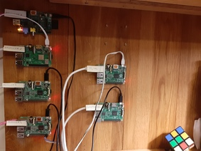

# (WIP) Motivation and roadmap

Gathering information like temperature is a perfect case to have a lot of fun with, use different technologies just to see if they fit the picture well and provide something that is cool to watch.

I can see the scenario as follows:
1. gather CPU temperature that is already available in Raspberry Pi
2. store it in good old RDBMS MySQL
3. store it in Cassandra database that was already used in [Stock LCD display](docs/stock_lcd_display.md)
4. store it in Kafka, as messagin system like that is perfect for such job and it is just a beatiful concept to decouple producers of data from consumers of data
5. store it in good old RDBMS MySQL, but this time the script that gathers the temperature will not even know about that - we will use Kafka for that, as the data is already there
6. display it on Grafana, just to have a nice view

Even more fun with data
1. configure Kafka to store the data "since the beginning" which will allow us to build external systems for analysis like Hadoop
2. play with Kafka and see how we can make it break/fix/scale

# First things first

[Monitoring and benchmarking](monitoring.md)

[MySQL](mysql.md)


# Kafka (WIP)

Nice links:
- https://medium.com/activewizards-machine-learning-company/kafka-monitoring-with-prometheus-telegraf-and-grafana-6228fed736f1

Download Kafka from https://kafka.apache.org/downloads
```
# cd /opt
# wget http://ftp.man.poznan.pl/apache/kafka/2.3.0/kafka_2.12-2.3.0.tgz
# sha512sum kafka_2.12-2.3.0.tgz 
a5ed591ab304a1f16f7fd64183871e38aabf814a2c1ca86bb3d064c83e85a6463d3c55f4d707a29fc3d7994dd7ba1f790b5a6219c6dffdf472afd99cee37892e  kafka_2.12-2.3.0.tgz
# tar xvzf kafka_2.12-2.3.0.tgz

# cd /opt/kafka_2.12-2.3.0
# bin/zookeeper-server-start.sh config/zookeeper.properties &
```

Before starting Kafka, let's decrease the memory first to avoid Out Of Memory errors.

    # vi ~/.bashrc
	export KAFKA_HEAP_OPTS="-Xmx200M -Xms200M"
	export PATH=$PATH:/opt/kafka_2.12-2.3.0/bin
	
	
    # cd /opt/kafka_2.12-2.3.0
    # bin/kafka-server-start.sh config/server.properties &


On producers

	# pip install kafka-python

Let's produce some messages

## One producer -> Kafka

Just to warm things up let's compare the performance of one producer with Kafka and Mysql.

	$ python collect.py --backend kafka


| Backend | TPS producer4, one thread | Prod util | Cons util         |
|---------|---------------------------|-----------|-------------------|
| MySQL   | 238                       | CPU 11%   | CPU 21%, IO 320ms |
| Kafka   | 147                       | CPU 25%   | CPU 9%, IO 4ms    |


Conclusion: One producer thread is able to generate 238TPS if mysql is used as backend and 147TPS if Kafka is used. To be honest, I do not know why there is such a big difference. The concept of commit is a little bit different between Kafka and MySQL. In MySQL commit is confirmed if it is written permanently (IO sync) to the commit log. That is an expensive operation in terms of IO. In Kafka data is commited when it was written to all in-sync replicas, as we are using only one broker at this time - this is just one machine, and what is more important this is an in-memory confirmation, there is no underlying IO sync. So Kafka should be much faster than mysql in that aspect. 

But we can't argue with facts, those are the numbers I get. All other differences will make it fun to watch how it goes if we introduce additional producers.

Let's see how the test goes if we run it like we did with the best score so far with mysql. Let's even take the score where we were commiting every 1000 inserts to lower the pressure on IO and it was practically completely utilising CPU as well.

	$ ./multi_collect.sh --backend kafka

| Backend | TPS prod1-4, 2xCPU thr | Prod     | Cons util         | bottleneck |
|---------|------------------------|----------|-------------------|------------|
| MySQL   | 2840                   | CPU 70%  | CPU 90%, IO 233ms | consumer   |
| Kafka   | 2600                   | CPU 100% | CPU 22%, IO 151ms | producers  |


We actually got similar performance, but the test with Kafka finished with clear bottleneck on the producers side rather than in MySQL case where it was consumer that could not go on any more.

Actually with 2600TPS Kafka barely makes a sweat with CPU 22% and 151ms IO time in a second.

Nice, time to introduce more powerfull producers again.

## Replacing Second producer




Looks like the Raspberry Pi's1 do not have a long career ahead, even in project like that. With one RPi2 as a consumer (MySql or Kafka so far), I am able to consume messages generated by 2 x RPi2 + 2 x RPi1. That is impressive on its own, and with Kafka it looks like I can simply do more.

Replacing producer2 Raspberry Pi1 with Pi3, the fastest so far in the test.

| TPS  | consumer | producer1-4        | bottleneck |
|------|----------|--------------------|------------|
| 4900 | CPU 34%  | CPU 100%, IO 150ms | producers  |

Wow, that is a nice comparison in RPis models itself.

Let's, just for fun, check how different RPi models are able to produce the load.

| Model                     | Kafka TPS one thread | Kafka TPS  all threads |
| RPi1 (1 x 900 MHz CPU)    | 100 (100% CPU)       | 50 x 2 = 100           |
| RPi2mB (4 x 1.2 GHz CPU)  | 149 (35% CPU)        | 151 x 8 = 1208         |
| RPi3mB+ (4 x 1.4 GHz CPU) | 326 (33% CPU)        | 290 x 8 = 2320         |


## Add more powerfull producers
The plan is as following

1. Keep adding producers until you see that Kafka is the bottleneck
2. Increase the throughput by adding another Kafka broker (let it be as well RPi1)

I added new kid to the producers, namely RPi4mB, let's see what it can do.

| Model  | Kafka TPS one thread | Kafka TPS  all threads |
| RPi4mB | 583 (36% CPU)        | 560 x 8 = 4480         |
|        |                      |                        |


| Producer(s) | Consumer(s) |
| RPi3mB+     | RPi2mB      |
|             |             |


OK, I am a bit tired of adding another producers, so I used my desktop PC. Now I am able to reach to 70% CPU on Kafka consumer, so easily can consider that I need to add another broker 

| producers | 3 x RPi4 + desktop PC      |
| consumer  | CPU 80%, IO peaks in 600ms |

Let's add another broker to Kafka cluster. (using cassandra2 node, but the nameing is misleading)

Nice links:
- https://svn.apache.org/repos/asf/kafka/site/082/ops.html
- https://kafka.apache.org/quickstart

Just start broker, we will use zookeeper from the first broker
    # vi server.properties
	broker.id=1
	zookeeper.connect=mysql:2181
	
    # export KAFKA_HEAP_OPTS="-Xmx200M -Xms200M"
    # cd /opt/kafka_2.12-2.3.0
    # bin/kafka-server-start.sh config/server.properties &

    # bin/kafka-topics.sh --describe --bootstrap-server localhost:9092 --topic temperature
Topic:temperature	PartitionCount:1	ReplicationFactor:1	Configs:segment.bytes=1073741824
	Topic: temperature	Partition: 0	Leader: 0	Replicas: 0	Isr: 0


Now if I run the load then nothing changes.

    # bin/kafka-topics.sh --describe --bootstrap-server localhost:9092 --topic temperature

Topic:temperature	PartitionCount:1	ReplicationFactor:1	Configs:segment.bytes=1073741824
	Topic: temperature	Partition: 0	Leader: 0	Replicas: 0	Isr: 0


    # cat topics-to-move.json
{"topics": [{"topic": "temperature"}],
 "version":1
}

bin/kafka-reassign-partitions.sh --zookeeper localhost:2181 --topics-to-move-json-file topics-to-move.json --broker-list "0,1" --generate 
Current partition replica assignment
{"version":1,"partitions":[{"topic":"temperature","partition":0,"replicas":[0],"log_dirs":["any"]}]}
Proposed partition reassignment configuration
{"version":1,"partitions":[{"topic":"temperature","partition":0,"replicas":[1],"log_dirs":["any"]}]}


    # cat expand-cluster-reassignment.json
{"version":1,"partitions":[{"topic":"temperature","partition":0,"replicas":[1],"log_dirs":["any"]}]}
    # bin/kafka-reassign-partitions.sh --zookeeper localhost:2181 --reassignment-json-file expand-cluster-reassignment.json --execute

I can see that he is moving data.

    # bin/kafka-topics.sh --describe --bootstrap-server localhost:9092 --topic temperature
Topic:temperature	PartitionCount:1	ReplicationFactor:1	Configs:segment.bytes=1073741824
	Topic: temperature	Partition: 0	Leader: 1	Replicas: 1	Isr: 1


Ok, is that enough? Let's repeat the test.
-> now all the load shifted to the second broker (what is funny is that we did not change the connection address)

bin/kafka-reassign-partitions.sh --zookeeper localhost:2181 --reassignment-json-file expand-cluster-reassignment.json --verify

Status of partition reassignment: 
Reassignment of partition temperature-0 completed successfully

Check
bin/kafka-topics.sh --describe --zookeeper localhost:2181 --topic temperature
Topic:temperature	PartitionCount:1	ReplicationFactor:1	Configs:
	Topic: temperature	Partition: 0	Leader: 0	Replicas: 0	Isr: 0

Change nr of partitions
bin/kafka-topics.sh --alter --zookeeper localhost:2181 --topic temperature --partitions 10

Hm, I now see the CPU load is spread between two brokers, but it is not really lower

| broker 1 |
| broker 2 | 

Ok, may it be that I simply see replication kicking in? It should be visible (lowered CPU when I have 4 node cluster)

192.168.1.103 - producer6 (not sure why it can't register itself in DNS)

Different approach, let's run 2 brokers on one host, then I should have the basic replication happening on one host and when I add another it will be more realistic.

Ok, let's create two brokers on one host and see the performance.

```
# cp server.properties server-1.properties 
# cp server.properties server-2.properties

Changes like on https://kafka.apache.org/quickstart

Start zookeeper like usuall
# cd /opt/kafka_2.12-2.3.0
# bin/zookeeper-server-start.sh config/zookeeper.properties &

# export KAFKA_HEAP_OPTS="-Xmx200M -Xms200M"
# bin/kafka-server-start.sh config/server-1.properties &
# bin/kafka-server-start.sh config/server-2.properties &
```

bin/kafka-topics.sh --describe --zookeeper localhost:2181 --topic temperature
Topic:temperature	PartitionCount:1	ReplicationFactor:1	Configs:
	Topic: temperature	Partition: 0	Leader: 1	Replicas: 1	Isr: 1

bin/kafka-topics.sh --alter --zookeeper localhost:2181 --topic temperature --partitions 10
bin/kafka-topics.sh --describe --zookeeper localhost:2181 --topic temperature
Topic:temperature	PartitionCount:10	ReplicationFactor:1	Configs:
	Topic: temperature	Partition: 0	Leader: 1	Replicas: 1	Isr: 1
	Topic: temperature	Partition: 1	Leader: 2	Replicas: 2	Isr: 2
	Topic: temperature	Partition: 2	Leader: 1	Replicas: 1	Isr: 1
	Topic: temperature	Partition: 3	Leader: 2	Replicas: 2	Isr: 2
	Topic: temperature	Partition: 4	Leader: 1	Replicas: 1	Isr: 1
	Topic: temperature	Partition: 5	Leader: 2	Replicas: 2	Isr: 2
	Topic: temperature	Partition: 6	Leader: 1	Replicas: 1	Isr: 1
	Topic: temperature	Partition: 7	Leader: 2	Replicas: 2	Isr: 2
	Topic: temperature	Partition: 8	Leader: 1	Replicas: 1	Isr: 1
	Topic: temperature	Partition: 9	Leader: 2	Replicas: 2	Isr: 2

That is strange. I connect with one producer, can make the Kafka reach 100% utilisation, then connect with another producer and the second one is able to generate as many messages as the first one as well.

Ok, enabling sync at the producers
+           # async
+           #producer.send('temperature', value=data)
+           # sync
+           future = producer.send('temperature', value=data)
+           result = future.get(timeout=60)

And now it finally looks like something predictable.

bin/kafka-topics.sh --delete --zookeeper localhost:2181 --topic temperature
Topic temperature is marked for deletion.
bin/kafka-topics.sh --create --zookeeper localhost:2181 --topic temperature --partitions 10 --replication-factor 2
Created topic temperature.

bin/kafka-topics.sh --describe --zookeeper localhost:2181 --topic temperature
Topic:temperature	PartitionCount:10	ReplicationFactor:2	Configs:
	Topic: temperature	Partition: 0	Leader: 2	Replicas: 2,1	Isr: 2,1
	Topic: temperature	Partition: 1	Leader: 1	Replicas: 1,2	Isr: 1,2
	Topic: temperature	Partition: 2	Leader: 2	Replicas: 2,1	Isr: 2,1
	Topic: temperature	Partition: 3	Leader: 1	Replicas: 1,2	Isr: 1,2
	Topic: temperature	Partition: 4	Leader: 2	Replicas: 2,1	Isr: 2,1
	Topic: temperature	Partition: 5	Leader: 1	Replicas: 1,2	Isr: 1,2
	Topic: temperature	Partition: 6	Leader: 2	Replicas: 2,1	Isr: 2,1
	Topic: temperature	Partition: 7	Leader: 1	Replicas: 1,2	Isr: 1,2
	Topic: temperature	Partition: 8	Leader: 2	Replicas: 2,1	Isr: 2,1
	Topic: temperature	Partition: 9	Leader: 1	Replicas: 1,2	Isr: 1,2

| consumers | 2 brokers x 1 host | CPU 84%-93%, IO small peaks 100ms |
| producers | 1 x RPi4           | CPU 60%-64%,  T_TRANS: 129t       |


-> looks like the Kafka consumer is the bottlenect already

Ok, let's add more producers to be sure
| consumers | 2 brokers x 1 host | CPU 96%, IO peaks up to 500ms      |
| producers | 2 x RPi4           | CPU 30%-50%, T_TRANS: 94t+92t=186t |

Ok, what will happen with 3 producers
| consumers | 2 brokers x 1 host | CPU 96%, IO very high 750ms      | 
| producers | 3 x RPi4           | CPU 18%-41%, T_TRANS: 71t+58t+68t=197t |
-> clearly we reached the end, Kafka consumer is the bottleneck, both in IO and CPU


## Add more brokers

We will add another RPi2 host with two brokers. Now we will run at mysql adn consumer1 hosts.

```
# cd /opt/kafka_2.12-2.3.0/config
# cp server.properties server-3.properties 
# cp server.properties server-4.properties
> broker.id=3
> listeners=PLAINTEXT://:9095
> log.dirs=/tmp/kafka-logs-3
> zookeeper.connect=mysql:2181
# cd /opt/kafka_2.12-2.3.0
# bin/kafka-server-start.sh config/server-3.properties &
# bin/kafka-server-start.sh config/server-4.properties &

```

bin/kafka-topics.sh --delete --zookeeper localhost:2181 --topic temperature
Topic temperature is marked for deletion.
bin/kafka-topics.sh --create --zookeeper localhost:2181 --topic temperature --partitions 10 --replication-factor 2
Created topic temperature.

bin/kafka-topics.sh --describe --zookeeper localhost:2181 --topic temperature
Topic:temperature	PartitionCount:10	ReplicationFactor:2	Configs:
	Topic: temperature	Partition: 0	Leader: 2	Replicas: 2,3	Isr: 2,3
	Topic: temperature	Partition: 1	Leader: 3	Replicas: 3,4	Isr: 3,4
	Topic: temperature	Partition: 2	Leader: 4	Replicas: 4,1	Isr: 4,1
	Topic: temperature	Partition: 3	Leader: 1	Replicas: 1,2	Isr: 1,2
	Topic: temperature	Partition: 4	Leader: 2	Replicas: 2,4	Isr: 2,4
	Topic: temperature	Partition: 5	Leader: 3	Replicas: 3,1	Isr: 3,1
	Topic: temperature	Partition: 6	Leader: 4	Replicas: 4,2	Isr: 4,2
	Topic: temperature	Partition: 7	Leader: 1	Replicas: 1,3	Isr: 1,3
	Topic: temperature	Partition: 8	Leader: 2	Replicas: 2,1	Isr: 2,1
	Topic: temperature	Partition: 9	Leader: 3	Replicas: 3,2	Isr: 3,2

-> Nice, so now the load should be evenly spread through all the brokers.

| consumers | 4 brokers in 2 host | CPU 70%, IO fine 39ms |
| producers | 1 x RPi4            | CPU 60%, T_TRANS: 108 |
ok, that is understandable, a little bit lower score as we have to travel the network to communicate between the brokers.

| consumers | 4 brokers in 2 host | CPU 72%-90%, IO up to 150ms        |
| producers | 2 x RPi4            | CPU 50%-55%, T_TRANS: 85t+87t=172t |

| consumers | 4 brokers in 2 host | CPU 77%-87%, IO up to ms        |
| producers | 3 x RPi4            | CPU 32%-47%, T_TRANS: 66+65+75=206t |
-> Hm, not sure what to think about that. We cleraly have room in producers what suggests that consumers are the bottleneck.

Let's add another host with two brokers.

## Add third broker node

```
# cd /opt/kafka_2.12-2.3.0
# bin/kafka-server-start.sh config/server-5.properties &
# bin/kafka-server-start.sh config/server-6.properties &

```
bin/kafka-topics.sh --describe --zookeeper localhost:2181 --topic temperature
Topic:temperature	PartitionCount:10	ReplicationFactor:2	Configs:
	Topic: temperature	Partition: 0	Leader: 3	Replicas: 3,6	Isr: 3,6
	Topic: temperature	Partition: 1	Leader: 4	Replicas: 4,1	Isr: 4,1
	Topic: temperature	Partition: 2	Leader: 5	Replicas: 5,2	Isr: 5,2
	Topic: temperature	Partition: 3	Leader: 6	Replicas: 6,3	Isr: 6,3
	Topic: temperature	Partition: 4	Leader: 1	Replicas: 1,4	Isr: 1,4
	Topic: temperature	Partition: 5	Leader: 2	Replicas: 2,5	Isr: 2,5
	Topic: temperature	Partition: 6	Leader: 3	Replicas: 3,1	Isr: 3,1
	Topic: temperature	Partition: 7	Leader: 4	Replicas: 4,2	Isr: 4,2
	Topic: temperature	Partition: 8	Leader: 5	Replicas: 5,3	Isr: 5,3
	Topic: temperature	Partition: 9	Leader: 6	Replicas: 6,4	Isr: 6,4

| consumers | 6 brokers in 3 host | CPU 42-65%, IO fine 39ms |
| producers | 1 x RPi4            | CPU 69%, T_TRANS: 113t   |

| consumers | 6 brokers in 3 host | CPU 58-83%
| producers | 3 x RPi4            | CPU 54-59, T_TRANS: 86+91+89=266t |

| consumers | 6 brokers in 3 host | CPU 66-80
| producers | 4 x RPi4            | CPU 50%, T_TRANS: 70+78+83+80=311 |

Questions:
- why if I still have a room with producers and reach 266t when adding another producer makes it go up to 311t? Clearly consumers can do more, and producers but somehow I need to add another producer to make the score go up.

Ok, let's play with different topic settings.

### replication-factor 1

bin/kafka-topics.sh --delete --zookeeper localhost:2181 --topic temperature
bin/kafka-topics.sh --create --zookeeper localhost:2181 --topic temperature --partitions 10 --replication-factor 1
bin/kafka-topics.sh --describe --zookeeper localhost:2181 --topic temperature
Topic:temperature	PartitionCount:10	ReplicationFactor:1	Configs:
	Topic: temperature	Partition: 0	Leader: 6	Replicas: 6	Isr: 6
	Topic: temperature	Partition: 1	Leader: 1	Replicas: 1	Isr: 1
	Topic: temperature	Partition: 2	Leader: 2	Replicas: 2	Isr: 2
	Topic: temperature	Partition: 3	Leader: 3	Replicas: 3	Isr: 3
	Topic: temperature	Partition: 4	Leader: 4	Replicas: 4	Isr: 4
	Topic: temperature	Partition: 5	Leader: 5	Replicas: 5	Isr: 5
	Topic: temperature	Partition: 6	Leader: 6	Replicas: 6	Isr: 6
	Topic: temperature	Partition: 7	Leader: 1	Replicas: 1	Isr: 1
	Topic: temperature	Partition: 8	Leader: 2	Replicas: 2	Isr: 2
	Topic: temperature	Partition: 9	Leader: 3	Replicas: 3	Isr: 3

| consumers | 6 brokers in 3 host | CPU 19-20% |
| producers | 1 x RPi4            | CPU 92% T_TRANS: 137t |
-> nice, clearly we need more producers

| consumers | 6 brokers in 3 host | CPU 31,29,24 |
| producers | 2 x RPi4            | CPU 85%,91% T_TRANS: 133+132t=265t |

| consumers | 6 brokers 3 host | CPU 54,34,37%                                  |
| producers | 4 x RPi4         | CPU 81,85,85,86% T_TRANS: 125+117+125+125=492t |
-> still looks like producers are the bottleneck here

### replication-factor 1 in 1 partition

bin/kafka-topics.sh --delete --zookeeper localhost:2181 --topic temperature
bin/kafka-topics.sh --create --zookeeper localhost:2181 --topic temperature --partitions 1 --replication-factor 1
bin/kafka-topics.sh --describe --zookeeper localhost:2181 --topic temperature
Topic:temperature	PartitionCount:1	ReplicationFactor:1	Configs:
	Topic: temperature	Partition: 0	Leader: 2	Replicas: 2	Isr: 2

| consumers | 6 brokers in 3 host | CPU 38,1,1% |
| producers | 1 x RPi4            | CPU 76% T_TRANS: 186t |
-> clearly as we have only one partition only one broker is managing it, so although we have 3 nodes and 6 brokers only one is busy

| consumers | 6 brokers in 3 host | CPU 61,1,1% |
| producers | 2 x RPi4            | CPU 71,71% T_TRANS: 164+163=327t |


| consumers | 6 brokers 3 host | CPU 78,1,1                                   |
| producers | 4 x RPi4         | CPU 46,46,45,45 T_TRANS: 109+109+115+114=447 |

Ok, although we have only one broker, we can still have a nice score.

### weird example

bin/kafka-topics.sh --create --zookeeper localhost:2181 --topic temperature --partitions 10 --replication-factor 6
bin/kafka-topics.sh --describe --zookeeper localhost:2181 --topic temperature
Topic:temperature	PartitionCount:10	ReplicationFactor:6	Configs:
Topic: temperature	Partition: 0	Leader: 4	Replicas: 4,1,2,3,5,6	Isr: 4,1,2,3,5,6
Topic: temperature	Partition: 1	Leader: 5	Replicas: 5,2,3,4,6,1	Isr: 5,2,3,4,6,1
Topic: temperature	Partition: 2	Leader: 6	Replicas: 6,3,4,5,1,2	Isr: 6,3,4,5,1,2
Topic: temperature	Partition: 3	Leader: 1	Replicas: 1,4,5,6,2,3	Isr: 1,4,5,6,2,3
Topic: temperature	Partition: 4	Leader: 2	Replicas: 2,5,6,1,3,4	Isr: 2,5,6,1,3,4
Topic: temperature	Partition: 5	Leader: 3	Replicas: 3,6,1,2,4,5	Isr: 3,6,1,2,4,5
Topic: temperature	Partition: 6	Leader: 4	Replicas: 4,2,3,5,6,1	Isr: 4,2,3,5,6,1
Topic: temperature	Partition: 7	Leader: 5	Replicas: 5,3,4,6,1,2	Isr: 5,3,4,6,1,2
Topic: temperature	Partition: 8	Leader: 6	Replicas: 6,4,5,1,2,3	Isr: 6,4,5,1,2,3
Topic: temperature	Partition: 9	Leader: 1	Replicas: 1,5,6,2,3,4	Isr: 1,5,6,2,3,4


1 producer - 38%CPU 46t (55t second run), 
3 consumers - 68,79,70%CPU

4 producers - 25,25,27,23%CPU 32,31,33,34t
3 consumers: 99,100,100CPU

That keeps me wondering, why I still have idle CPU both on producer and consumer in the firs run and I can't get a bigger score, but when I add producers then I am able to manage a bogger score. Maybe I just need more threads? let's run 1 producer but with large number of threads.

1 producer - 81%CPU if forced 32 threads, 126t
3 consumers - 87,93,92%CPU

Nice! That is what I was talking about. I need to create more threads per producer.

1 producer - 95%CPU if forced 64 threads, 138t
3 consumers - 83,99,89%CPU

Ok, looks like with this in mind I need to repeat my tests.

2 producers, 64 threads each - 92,85%CPU 127+122t=249t
3 consumers: 93,89,95

WTF, again the score almost doubles when I add producers, although it lookes like consumers are already on almost 100% capacity. Do not get that.

## changing sync settings

bin/kafka-topics.sh --create --zookeeper localhost:2181 --topic temperature --partitions 10 --replication-factor 6

+           future = producer.send('temperature', value=data)
+           try:
+               record_metadata = future.get(timeout=10)
+           except KafkaError:
+               # Decide what to do if produce request failed...
+               log.exception()
+           pass

1 producer - 94%CPU, 138t
3 consumers - 85,91,88
-> same as the last run

2 producers - 94%CPU, 136+104t
3 consumers - 25,88,90
-> HOW is he able to practically double the performance if at the first run he was almost at the CPU capacity???


## back to basics, one broker

Ok, the theory now is that: this weird behavior I see is because of large buffer/block/whatever size, I have to manage that block already and if I put one message into it, or two does not matter.

cd /opt/kafka_2.12-2.3.0/config
cp server-1.properties server-x1.properties
socket.send.buffer.bytes=1024
socket.receive.buffer.bytes=1024
```
# cd /opt/kafka_2.12-2.3.0
# bin/zookeeper-server-start.sh config/zookeeper.properties &
# bin/kafka-server-start.sh config/server-x1.properties &

```
bin/kafka-topics.sh --create --zookeeper localhost:2181 --topic temperature --partitions 1 --replication-factor 1

1 thread producer: CPU 16%, TPS: 143 Average TPS: 137 Total trans: 41258
1 Kafka consumer: CPU 13%, 

32 thread producer: CPU 100%, TOTAL_TRANS: 216700
1 Kafka consumer: CPU 35%

8 thread producer: CPU 88%, TOTAL_TRANS: 192068
1 Kafka consumer: CPU 31%

12 thread producer: CPU 97%, TOTAL_TRANS: 205681
1 Kafka consumer: CPU 33%

Hm, on the other hand, he just can do a lot. Maybe it is how replication works? With two brokers on one host one is active and the other one is receiving. As long as the active accepts the write, this info goes to producer. After that he replicates it.

How to force the ack to producer to be sent when it is replicated?

https://kafka.apache.org/documentation/

"Kafka allows producers to wait on acknowledgement so that a write isn't considered complete until it is fully replicated and guaranteed to persist even if the server written to fails."

https://stackoverflow.com/questions/44992566/kafka-producer-acknowledgement

First need to start another broker, on the same host.
bin/kafka-server-start.sh config/server-x2.properties &

bin/kafka-topics.sh --delete --zookeeper localhost:2181 --topic temperature

bin/kafka-topics.sh --create --zookeeper localhost:2181 --topic temperature --partitions 1 --replication-factor 2 --config min.insync.replicas=2

Changing producer code:
producer = KafkaProducer(bootstrap_servers=['192.168.1.90:9092'],
                            value_serializer=lambda x:
                            dumps(x).encode('utf-8'))
to
producer = KafkaProducer(bootstrap_servers=['192.168.1.90:9092'],
                            acks=-1,
                            value_serializer=lambda x:
                            dumps(x).encode('utf-8'))

bin/kafka-topics.sh --describe --zookeeper localhost:2181 --topic temperature
Topic:temperature	PartitionCount:1	ReplicationFactor:2	Configs:min.insync.replicas=2
	Topic: temperature	Partition: 0	Leader: 2	Replicas: 2,1	Isr: 2,1


1 thread producer: CPU 7%, TPS: 35 Average TPS: 24 Total trans: 7208
1 Kafka consumer: CPU 25%
-> ok, that looks different that the "Fire and forget" way of doing things previously where I got Total trans: 41258

32 thread producer: CPU 90%, Average TPS: 17, TOTAL_TRANS: 167009
1 Kafka consumer: CPU 68%

8 thread producer: CPU 50%, TOTAL_TRANS: 104876
1 Kafka consumer(2 brokers): CPU 48%

2 x producers x 32threads: 87,80% TOTAL_TRANS: 167+147, 177+178
1 Kafka consumer(2 brokers): CPU 77%

3 x producers x 32threads: 
1 Kafka consumer(2 brokers): CPU 

Someohow unstable producers, they finish up earlier than expected. Most likely something to do with frequent UP/Down network link that I see on RPi4.

I moved all RPi4's to the same switch and it is fine now.

After some idle time.

3 x producers x 32threads: CPU76,75,76% TOTAL_TRANS: 154+153+154=461t
1 Kafka consumer(2 brokers): CPU 81% 

4 x producers x 32threads: CPU50,75,50,50 TOTAL_TRANS: 104+157+104+104=469t
1 Kafka consumer(2 brokers): CPU 82%

WOW, maybe that is finally that. I reached to the point where I have constant number of inserts I can do in 5min - around 460t and that turns to the load on the one machine with two brokers up to 82%.

Let's add another producer, if the load on producers will drop and the number of inserts will be at the same leve that would mean that I see the moment when adding brokers will be beneficial.

5 x producers x 32threads: CPU 45,75,47,41,69 TOTAL_TRANS: 83+144+83+84+72=466t
1 Kafka consumer(2 brokers): CPU 83%

Just for the record:
producers: RPi4 prod2, RPi4 prod3, RPi4 prod4, RPi4 prod5, RPi3 prod6
consumer: RPi2 mysql (hostname, misleading, I know)

WOW, for the first time adding another producer did not increase the overall score.

Let's add another machine with two brokers and keep all the rest the same.

Obviously just after adding new brokers nothing will happen.

bin/kafka-topics.sh --describe --zookeeper localhost:2181 --topic temperature
Topic:temperature	PartitionCount:1	ReplicationFactor:1	Configs:
	Topic: temperature	Partition: 0	Leader: 1	Replicas: 1	Isr: 1

Hm, that is funny, I restarted all the env and now my topic does not have the Configs:min.insync.replicas=2 it previously had, but the producers now have `acks=-1` which apparently does the trick.

Ok, let's repeat the tests with `min.insync.replicas=2` config.

bin/kafka-topics.sh --delete --zookeeper localhost:2181 --topic temperature
bin/kafka-topics.sh --create --zookeeper localhost:2181 --topic temperature --partitions 1 --replication-factor 2 --config min.insync.replicas=2
bin/kafka-topics.sh --describe --zookeeper localhost:2181 --topic temperature
Topic:temperature	PartitionCount:1	ReplicationFactor:2	Configs:min.insync.replicas=2
	Topic: temperature	Partition: 0	Leader: 3	Replicas: 3,1	Isr: 3,1

Ok, shutdown the new machine and repeat the test.

Topic:temperature	PartitionCount:1	ReplicationFactor:2	Configs:min.insync.replicas=2
	Topic: temperature	Partition: 0	Leader: 1	Replicas: 3,1	Isr: 1
-> we can see nicely that replicas are not in sync now

Recreate the topic again.
bin/kafka-topics.sh --delete --zookeeper localhost:2181 --topic temperature
bin/kafka-topics.sh --create --zookeeper localhost:2181 --topic temperature --partitions 1 --replication-factor 2 --config min.insync.replicas=2
bin/kafka-topics.sh --describe --zookeeper localhost:2181 --topic temperature
Topic:temperature	PartitionCount:1	ReplicationFactor:2	Configs:min.insync.replicas=2
	Topic: temperature	Partition: 0	Leader: 2	Replicas: 2,1	Isr: 2

3 x producers x 32threads: CPU 50,75,50  TOTAL_TRANS: 80+135+82=297t
1 Kafka consumer(2 brokers): CPU 81%

??why producer2 is still doing twice the work???

4 x producers x 32threads: CPU 45,73,45,45 TOTAL_TRANS: 80+141+79+80=380t
1 Kafka consumer(2 brokers): CPU 81%
-> and now again, WHY? I added new producer, consumer is still at the same level but the score got bigger, WTF?

5 x producers x 32threads: CPU 45,70,43,43,60 TOTAL_TRANS: 74,133,72,73,66=418t
1 Kafka consumer(2 brokers): CPU 81 

WTF? Again?

Lesson learned:
- prevent the automatic topic creation, as it does not always is what you want

### Prevent auto topic creation + 3 brokers per host

Add in all brokers configuration
auto.create.topics.enable=false

bin/zookeeper-server-start.sh config/zookeeper.properties &
bin/kafka-server-start.sh config/server-x1.properties &
bin/kafka-server-start.sh config/server-x2.properties &
bin/kafka-server-start.sh config/server-x3.properties &

bin/kafka-topics.sh --delete --zookeeper localhost:2181 --topic temperature
bin/kafka-topics.sh --create --zookeeper localhost:2181 --topic temperature --partitions 1 --replication-factor 3 --config min.insync.replicas=3
bin/kafka-topics.sh --describe --zookeeper localhost:2181 --topic temperature

-> I am swapping too much on this RPi2


1 x producers x 32threads: CPU 81% TOTAL_TRANS: 147t
1 Kafka consumer(3 brokers): CPU 71%

2 x producers x 32threads: CPU 53,83% TOTAL_TRANS: 118+167t
1 Kafka consumer(3 brokers): CPU 81%

HOW on earth producer3 (with its magic higher score and CPU util) is able to produce another 167t when only 10% increase on broker? 

Magic solved - see troubleshooting.

1 x producers x 64threads: CPU 90% TOTAL_TRANS: 176
1 Kafka consumer(3 brokers): CPU 77%
-> so I can do more with more threads on producer, despite the fact that already had 32 of them and the producer was showing idle CPU which looked like consumer bottleneck.

1 x producers x 72threads: CPU 90% TOTAL_TRANS: 176
1 Kafka consumer(3 brokers): CPU 80%

1 x producers x 80threads: CPU 90% TOTAL_TRANS: 181
1 Kafka consumer(3 brokers): CPU 80%
-> Ok, can't do much more with more threads above 64.

2 x producers x 64threads: CPU 75,76% TOTAL_TRANS: 155,154
1 Kafka consumer(3 brokers): CPU 83% 
WTF? how I can do another 120t with only 3% increase on consumer? Looks like I am still doing fire and forget.

Time to gather the stats on the consumer site, and not in producers.

### Install kafka prometheus exporter
Nice links:
- https://github.com/danielqsj/kafka_exporter
- https://blog.knoldus.com/monitoring-kafka-with-prometheus-and-grafana/

wget https://github.com/danielqsj/kafka_exporter/releases/download/v1.2.0/kafka_exporter-1.2.0.linux-armv7.tar.gz
md5sum kafka_exporter-1.2.0.linux-armv7.tar.gz 
f412b4ef0708c49c180210c4321e9e88  kafka_exporter-1.2.0.linux-armv7.tar.gz
tar xvzf kafka_exporter-1.2.0.linux-armv7.tar.gz

cd /opt/kafka_exporter-1.2.0.linux-armv7#
./kafka_exporter --kafka.server=mysql:9092
Listening on :9308

http://mysql:9308


Following: https://blog.knoldus.com/monitoring-kafka-with-prometheus-and-grafana/

export KAFKA_OPTS="$KAFKA_OPTS -javaagent:$PWD/jmx_prometheus_javaagent-0.6.jar=7071:$PWD/kafka-0-8-2.yml"

http://mysql:7071/metrics
-> nice


Hm, maybe let's create a consumer to see how many messages went actually through.

kafka-console-consumer.sh --bootstrap-server mysql:9092 --topic temperature
-> ok, but that fetches all the messages, hm, I could fetch dem after the load is done not to stress the consumers during the load

### tests repeated, default conf, 1 broker
bin/kafka-server-start.sh config/server.properties
(topic auto created)

2 producers, 105987+104438=210425, match, kafka 80% CPU

3 producers, 99611+99838+52618=252067 client reported 251939, kafka 80% CPU

4 producers, 84440+83858+42000+42391=252689 client reported 251522, kafka 80% CPU
(repeat test, as I had uneven threads)

4 producers, 66868+64170+57619+63677=252334 client reported 252338  kafka 82% CPU
(OMG, all same load at producers - 35%)
-> OK, but it finally looks like I can't break above the 252t

### testing 2 custom conf
bin/kafka-server-start.sh config/server-x1.properties &
bin/kafka-server-start.sh config/server-x2.properties &

kafka-topics.sh --create --zookeeper localhost:2181 --topic temperature --partitions 1 --replication-factor 2 --config min.insync.replicas=2
kafka-topics.sh --describe --zookeeper localhost:2181 --topic temperature
Topic:temperature	PartitionCount:1	ReplicationFactor:2	Configs:min.insync.replicas=2
	Topic: temperature	Partition: 0	Leader: 1	Replicas: 1,2	Isr: 1,2

tests At revision 1395

kafka-console-consumer.sh --bootstrap-server mysql:9092 --topic temperature
-> do not see any messages. WTF?

Just with one broker
bin/kafka-server-start.sh config/server-x1.properties &
kafka-topics.sh --create --zookeeper localhost:2181 --topic temperature --partitions 1 --replication-factor 1 --config min.insync.replicas=1

kafka-console-consumer.sh --bootstrap-server mysql:9092 --topic temperature
-> kicks in after 10s


bin/kafka-server-start.sh config/server-1.properties &

2 producers, 161241+160148=321389 match 321389, kafka 80% CPU
hm, why so high? The only difference could be no kafka exporter JMX metrics to prometheus

kafka-topics.sh --describe --zookeeper localhost:2181 --topic temperature
Topic:temperature	PartitionCount:1	ReplicationFactor:1	Configs:min.insync.replicas=1
	Topic: temperature	Partition: 0	Leader: 1	Replicas: 1	Isr: 1

Ok, let's try with basic topic creation.
kafka-topics.sh --delete --zookeeper localhost:2181 --topic temperature
kafka-topics.sh --create --zookeeper localhost:2181 --topic temperature --partitions 1 --replication-factor 1

-> the same score.

OK, lets run the old broker, no JMX
-----
bin/zookeeper-server-start.sh config/zookeeper.properties
bin/kafka-server-start.sh config/server.properties 

kafka-topics.sh --create --zookeeper localhost:2181 --topic temperature --partitions 1 --replication-factor 1
kafka-topics.sh --describe --zookeeper localhost:2181 --topic temperature
Topic:temperature	PartitionCount:1	ReplicationFactor:1	Configs:
	Topic: temperature	Partition: 0	Leader: 0	Replicas: 0	Isr: 0

kafka-console-consumer.sh --bootstrap-server mysql:9092 --topic temperature
./multi_collect.sh --backend=kafka

2 producers(64); CPU 80,80%; 149458+148959=298417 match 298417, kafka 80% CPU
3 producers(64); CPU 74,73,72; 138934+137575+138724=415233 match 415233, kafka 82% CPU
4 producers(64); CPU 56,57,56,56; 111124+111266+108714+111822=442926 match 442926, kafka 82% CPU
5 producers(64); CPU 46,44,46,47,73; 94347+88557+92250+96539+77730=449423 cons 449437, kafka 82% CPU (producers2-5 RPi4, producer5 RPi3)

Ok, looks like I can't get pass 449437 for now.

Two brokers, replication 1 but 1 partitions
---
On purpose, nothing should be changed.

kafka-topics.sh --delete --zookeeper localhost:2181 --topic temperature

mysql(broker id=0):
bin/zookeeper-server-start.sh config/zookeeper.properties
bin/kafka-server-start.sh config/server.properties 

consumer1(broker id=3):
bin/kafka-server-start.sh config/server-3.properties

kafka-topics.sh --create --zookeeper localhost:2181 --topic temperature --partitions 1 --replication-factor 1
kafka-topics.sh --describe --zookeeper localhost:2181 --topic temperature
Topic:temperature	PartitionCount:1	ReplicationFactor:1	Configs:
	Topic: temperature	Partition: 0	Leader: 3	Replicas: 3	Isr: 3

kafka-console-consumer.sh --bootstrap-server mysql:9092 --topic temperature

5 producers(64); CPU 48,52,49,49,81; 85224+84366+83752+83659+71479=408480 match 408480  kafka CPU 10,82
-> as expected, cluster has two brokers but with 1 partition and 1 replication factor it has to be one of the brokers. This 10% on first kafka broker is because I moved the console consumer there, I will move it to another host.
(repeating)
5 producers(64); CPU 48,48,48,49,78; 97867+97765+97957+98697+82350=474636 match 474636  kafka CPU 1,82

Ok, looks like this is it with this setup. Now let's just add replication=2 with still one partition. It should just make both brokers active, and lower the score a little.

Two brokers, replication 2 but 1 partitions
--

kafka-topics.sh --delete --zookeeper localhost:2181 --topic temperature
kafka-topics.sh --create --zookeeper localhost:2181 --topic temperature --partitions 1 --replication-factor 2
kafka-topics.sh --describe --zookeeper localhost:2181 --topic temperature
Topic:temperature	PartitionCount:1	ReplicationFactor:2	Configs:
	Topic: temperature	Partition: 0	Leader: 0	Replicas: 0,3	Isr: 0,3

5 producers(64); CPU 41,42,46,50,74; 78284+74066+86091+89473+70917=398831 match 398831   kafka CPU 80,7
-> hm, not what I was expecting. Broker id=3 is practically idle (7%) just see some network.
(repeating)
5 producers(64); CPU 41,42,46,50,74; 86367+75210+80702+98158+71863=412300 match 412300
Ok, that is more or less what I was expecting. One way to explain why on broker=3 I get 474t and broker=0 I get 449t (or 412t with replication) is that they are on different switches.

What is a bit strange is that the replica has so little load.

Lesson learned: move everything to one switch.

Let's go for the higher score.

Two brokers, replication 1 but 10 partitions
---

kafka-topics.sh --delete --zookeeper localhost:2181 --topic temperature
kafka-topics.sh --create --zookeeper localhost:2181 --topic temperature --partitions 10 --replication-factor 1
kafka-topics.sh --describe --zookeeper localhost:2181 --topic temperature
Topic:temperature	PartitionCount:10	ReplicationFactor:1	Configs:
	Topic: temperature	Partition: 0	Leader: 0	Replicas: 0	Isr: 0
	Topic: temperature	Partition: 1	Leader: 3	Replicas: 3	Isr: 3
	Topic: temperature	Partition: 2	Leader: 0	Replicas: 0	Isr: 0
	Topic: temperature	Partition: 3	Leader: 3	Replicas: 3	Isr: 3
	Topic: temperature	Partition: 4	Leader: 0	Replicas: 0	Isr: 0
	Topic: temperature	Partition: 5	Leader: 3	Replicas: 3	Isr: 3
	Topic: temperature	Partition: 6	Leader: 0	Replicas: 0	Isr: 0
	Topic: temperature	Partition: 7	Leader: 3	Replicas: 3	Isr: 3
	Topic: temperature	Partition: 8	Leader: 0	Replicas: 0	Isr: 0
	Topic: temperature	Partition: 9	Leader: 3	Replicas: 3	Isr: 3


5 producers(64); CPU 78,80,80,80,83; 131238+127270+129923+133100+79595=601126 match 601126 kafka CPU 70,71
-> WOW, finally adding another broker helped with performance! Looks like I again need more producers.

Just out of curiosity

Two brokers, replication 2 but 10 partitions
---

kafka-topics.sh --delete --zookeeper localhost:2181 --topic temperature
kafka-topics.sh --create --zookeeper localhost:2181 --topic temperature --partitions 10 --replication-factor 2
kafka-topics.sh --describe --zookeeper localhost:2181 --topic temperature
Topic:temperature	PartitionCount:10	ReplicationFactor:2	Configs:
	Topic: temperature	Partition: 0	Leader: 3	Replicas: 3,0	Isr: 3,0
	Topic: temperature	Partition: 1	Leader: 0	Replicas: 0,3	Isr: 0,3
	Topic: temperature	Partition: 2	Leader: 3	Replicas: 3,0	Isr: 3,0
	Topic: temperature	Partition: 3	Leader: 0	Replicas: 0,3	Isr: 0,3
	Topic: temperature	Partition: 4	Leader: 3	Replicas: 3,0	Isr: 3,0
	Topic: temperature	Partition: 5	Leader: 0	Replicas: 0,3	Isr: 0,3
	Topic: temperature	Partition: 6	Leader: 3	Replicas: 3,0	Isr: 3,0
	Topic: temperature	Partition: 7	Leader: 0	Replicas: 0,3	Isr: 0,3
	Topic: temperature	Partition: 8	Leader: 3	Replicas: 3,0	Isr: 3,0
	Topic: temperature	Partition: 9	Leader: 0	Replicas: 0,3	Isr: 0,3

5 producers(64); CPU 51,55,48,58,61; 72362+91576+80247+99043+55109=398337 match 398337 kafka CPU 68,67
Hm, substantial drop with performance when adding replication.
(repeating with score 422785)

Three brokers, replication 1 but 10 partitions
---
Will that give me more performance?

consumer2(broker id=5)
bin/kafka-server-start.sh config/server-5.properties

kafka-topics.sh --delete --zookeeper localhost:2181 --topic temperature
kafka-topics.sh --create --zookeeper localhost:2181 --topic temperature --partitions 10 --replication-factor 1
kafka-topics.sh --describe --zookeeper localhost:2181 --topic temperature
Topic:temperature	PartitionCount:10	ReplicationFactor:1	Configs:
	Topic: temperature	Partition: 0	Leader: 5	Replicas: 5	Isr: 5
	Topic: temperature	Partition: 1	Leader: 0	Replicas: 0	Isr: 0
	Topic: temperature	Partition: 2	Leader: 3	Replicas: 3	Isr: 3
	Topic: temperature	Partition: 3	Leader: 5	Replicas: 5	Isr: 5
	Topic: temperature	Partition: 4	Leader: 0	Replicas: 0	Isr: 0
	Topic: temperature	Partition: 5	Leader: 3	Replicas: 3	Isr: 3
	Topic: temperature	Partition: 6	Leader: 5	Replicas: 5	Isr: 5
	Topic: temperature	Partition: 7	Leader: 0	Replicas: 0	Isr: 0
	Topic: temperature	Partition: 8	Leader: 3	Replicas: 3	Isr: 3
	Topic: temperature	Partition: 9	Leader: 5	Replicas: 5	Isr: 5


5 producers(64); CPU 81,90,83,84,98;   605519  ; kafka CPU 68,61,73
-> a little higher score than with two brokers, but I have idle CPU on brokers, so with 3 brokers, I just have more idle CPU.

Three brokers, replication 3 but 10 partitions
---
kafka-topics.sh --delete --zookeeper localhost:2181 --topic temperature
kafka-topics.sh --create --zookeeper localhost:2181 --topic temperature --partitions 10 --replication-factor 3
kafka-topics.sh --describe --zookeeper localhost:2181 --topic temperature
Topic:temperature	PartitionCount:10	ReplicationFactor:3	Configs:
	Topic: temperature	Partition: 0	Leader: 5	Replicas: 5,3,0	Isr: 5,3,0
	Topic: temperature	Partition: 1	Leader: 0	Replicas: 0,5,3	Isr: 0,5,3
	Topic: temperature	Partition: 2	Leader: 3	Replicas: 3,0,5	Isr: 3,0,5
	Topic: temperature	Partition: 3	Leader: 5	Replicas: 5,0,3	Isr: 5,0,3
	Topic: temperature	Partition: 4	Leader: 0	Replicas: 0,3,5	Isr: 0,3,5
	Topic: temperature	Partition: 5	Leader: 3	Replicas: 3,5,0	Isr: 3,5,0
	Topic: temperature	Partition: 6	Leader: 5	Replicas: 5,3,0	Isr: 5,3,0
	Topic: temperature	Partition: 7	Leader: 0	Replicas: 0,5,3	Isr: 0,5,3
	Topic: temperature	Partition: 8	Leader: 3	Replicas: 3,0,5	Isr: 3,0,5
	Topic: temperature	Partition: 9	Leader: 5	Replicas: 5,0,3	Isr: 5,0,3

5 producers(64); CPU 45,45,65,64,70 367328 ; kafka 68,59,62 
-> hm, now where is the bottleneck? Everything seems to have idle resources. Most likely it is because of this acks=all on producer site.

Three brokers, replication 3 but 10 partitions, async
---
Up to now I was forcing ack=all in producer class. 

producer = KafkaProducer(bootstrap_servers=['192.168.1.90:9092'],
                            acks=-1,
                            value_serializer=lambda x:
svn At revision 1395.

Now, let's remove it and see what happens.
-- acks=-1,
Committed revision 1396.

5 producers(64); CPU 83,77,78,
-> looks nice, but the script fails ocassionally

Traceback (most recent call last):
  File "collect.py", line 297, in <module>
    log.exception()
NameError: name 'log' is not defined

Fixing that with just an error message. Committed revision 1397.

5 producers(64); CPU 77,73,77,75,95; 137012+126396+131193+127769+84395=606765 matches 606765; kafka 83,71,80
-> nice, just because I do not wait for a confirmation that all replicas are sync I can do almost twice the nr of inserts.

increasing nr of threads again
---

Just out of curiosity increasing nr of threads again, to see if I can really stress producers.

Yes, 654134, 10% increase again.

Interstingly I can see that during the tests the temperature of the CPu reaches 
{"reading_date": "156946", "reading_location": "producer2_cpu", "reading_value": "80341"}
{"reading_date": "156  1", "reading_location": "producer3_cpu", "reading_value": "76932"}
{"reading_date": "156881", "reading_location": "producer4_cpu", "reading_value": "77419"}
{"reading_date": "156885", "reading_location": "producer5_cpu", "reading_value": "77419"}
{"reading_date": "156889", "reading_location": "producer6_cpu", "reading_value": "65528"}

Starting from around 60C up to 80C, last one producer6 is RPi3 which is by nature 10C colder under stress.

Conclusion:
-> I should get some radiators to avoid overheating and CPU throttling

Addind radiator.
 "1569070837982", "reading_location": "producer2_cpu", "reading_value": "76445"}
-> ok, 5C degrees lower, not sure if that makes the difference, 

### Operations

#### Move partitions to new broker while writing to partition

mysql(broker id=1):
bin/zookeeper-server-start.sh config/zookeeper.properties
bin/kafka-server-start.sh config/server-1.properties 

consumer1(broker id=3):
bin/kafka-server-start.sh config/server-3.properties 

kafka-topics.sh --create --zookeeper localhost:2181 --topic temperature --partitions 1 --replication-factor 2
kafka-topics.sh --describe --zookeeper localhost:2181 --topic temperature
Topic:temperature	PartitionCount:1	ReplicationFactor:2	Configs:
	Topic: temperature	Partition: 0	Leader: 3	Replicas: 3,1	Isr: 3,1

consumer2
kafka-console-consumer.sh --bootstrap-server mysql:9092 --topic temperature

1. Just shutdown of broker that is the leader.

2019-09-21 16:50:17,863 - WARNING - Node 3 connection failed -- refreshing metadata

[2019-09-21 17:22:05,467] WARN [Consumer clientId=consumer-1, groupId=console-consumer-43360] Connection to node 2147483644 (consumer1/192.168.1.13:9095) could not be established. Broker may not be available. (org.apache.kafka.clients.NetworkClient)

-> so that took like 1s and both consumer and producer could go on


Topic:temperature	PartitionCount:1	ReplicationFactor:2	Configs:
	Topic: temperature	Partition: 0	Leader: 1	Replicas: 3,1	Isr: 1

After the killed broker is up the leader stays the same
Total trans: 9534, consumer got 9531, so either I lost some, or my counting is flawed.

Topic:temperature	PartitionCount:1	ReplicationFactor:2	Configs:
	Topic: temperature	Partition: 0	Leader: 1	Replicas: 3,1	Isr: 1,3

So shorty after beeing up the now replica broker 1 catches up.

2. Graceful shutdown of the broker


#### Balancing leadership

Try bo bounce the server with

auto.leader.rebalance.enable=true

We start with
Topic:temperature	PartitionCount:1	ReplicationFactor:2	Configs:
	Topic: temperature	Partition: 0	Leader: 3	Replicas: 3,1	Isr: 3,1

Now reboot boker id 3

Topic:temperature	PartitionCount:1	ReplicationFactor:2	Configs:
	Topic: temperature	Partition: 0	Leader: 1	Replicas: 3,1	Isr: 1

Now start again broker 3

Topic:temperature	PartitionCount:1	ReplicationFactor:2	Configs:
	Topic: temperature	Partition: 0	Leader: 1	Replicas: 3,1	Isr: 1,3

-> no rebalancing back. Maybe this is some kind of topic parameter?

That parameter is true by default by the way. However, by default this rebalance occurs every 5 minutes.

And actually as there is only one partition, there is little point in rebalance, as the result is only one broker will be busy anyway. Let's create more partitions and repeat the test.

kafka-topics.sh --delete --zookeeper localhost:2181 --topic temperature
kafka-topics.sh --create --zookeeper localhost:2181 --topic temperature --partitions 6 --replication-factor 2
kafka-topics.sh --describe --zookeeper localhost:2181 --topic temperature

Topic:temperature	PartitionCount:6	ReplicationFactor:2	Configs:
	Topic: temperature	Partition: 0	Leader: 3	Replicas: 3,1	Isr: 3,1
	Topic: temperature	Partition: 1	Leader: 1	Replicas: 1,3	Isr: 1,3
	Topic: temperature	Partition: 2	Leader: 3	Replicas: 3,1	Isr: 3,1
	Topic: temperature	Partition: 3	Leader: 1	Replicas: 1,3	Isr: 1,3
	Topic: temperature	Partition: 4	Leader: 3	Replicas: 3,1	Isr: 3,1
	Topic: temperature	Partition: 5	Leader: 1	Replicas: 1,3	Isr: 1,3

Now reboot boker id 3
	Topic: temperature	Partition: 0	Leader: 1	Replicas: 3,1	Isr: 1
	Topic: temperature	Partition: 1	Leader: 1	Replicas: 1,3	Isr: 1
	Topic: temperature	Partition: 2	Leader: 1	Replicas: 3,1	Isr: 1
	Topic: temperature	Partition: 3	Leader: 1	Replicas: 1,3	Isr: 1
	Topic: temperature	Partition: 4	Leader: 1	Replicas: 3,1	Isr: 1
	Topic: temperature	Partition: 5	Leader: 1	Replicas: 1,3	Isr: 1

after 1 min
	Topic: temperature	Partition: 0	Leader: 1	Replicas: 3,1	Isr: 1,3
	Topic: temperature	Partition: 1	Leader: 1	Replicas: 1,3	Isr: 1,3
	Topic: temperature	Partition: 2	Leader: 1	Replicas: 3,1	Isr: 1,3
	Topic: temperature	Partition: 3	Leader: 1	Replicas: 1,3	Isr: 1,3
	Topic: temperature	Partition: 4	Leader: 1	Replicas: 3,1	Isr: 1,3
	Topic: temperature	Partition: 5	Leader: 1	Replicas: 1,3	Isr: 1,3

after 5 min
	Topic: temperature	Partition: 0	Leader: 3	Replicas: 3,1	Isr: 1,3
	Topic: temperature	Partition: 1	Leader: 1	Replicas: 1,3	Isr: 1,3
	Topic: temperature	Partition: 2	Leader: 3	Replicas: 3,1	Isr: 1,3
	Topic: temperature	Partition: 3	Leader: 1	Replicas: 1,3	Isr: 1,3
	Topic: temperature	Partition: 4	Leader: 3	Replicas: 3,1	Isr: 1,3
	Topic: temperature	Partition: 5	Leader: 1	Replicas: 1,3	Isr: 1,3


-> so he does the leader re-election automatically


#### What to do with: Leader: -1	Replicas: 3,1	Isr: 3

That is the situatio when there is only one ISR: 3 and that broker id down.

How to lead to this situation?

Let's start with this:
	Topic: temperature	Partition: 0	Leader: 3	Replicas: 3,1	Isr: 1,3
	Topic: temperature	Partition: 1	Leader: 1	Replicas: 1,3	Isr: 1,3
	Topic: temperature	Partition: 2	Leader: 3	Replicas: 3,1	Isr: 1,3
	Topic: temperature	Partition: 3	Leader: 1	Replicas: 1,3	Isr: 1,3
	Topic: temperature	Partition: 4	Leader: 3	Replicas: 3,1	Isr: 1,3
	Topic: temperature	Partition: 5	Leader: 1	Replicas: 1,3	Isr: 1,3

1. Shutdown broker 1
	Topic: temperature	Partition: 0	Leader: 3	Replicas: 3,1	Isr: 3
	Topic: temperature	Partition: 1	Leader: 3	Replicas: 1,3	Isr: 3
	Topic: temperature	Partition: 2	Leader: 3	Replicas: 3,1	Isr: 3
	Topic: temperature	Partition: 3	Leader: 3	Replicas: 1,3	Isr: 3
	Topic: temperature	Partition: 4	Leader: 3	Replicas: 3,1	Isr: 3
	Topic: temperature	Partition: 5	Leader: 3	Replicas: 1,3	Isr: 3

-> for a while the only in-sync replica is 3

2. Shutdown broker 3

Now the system is unavailable 

3. Startup broker 1

Topic:temperature	PartitionCount:6	ReplicationFactor:2	Configs:
	Topic: temperature	Partition: 0	Leader: -1	Replicas: 3,1	Isr: 3
	Topic: temperature	Partition: 1	Leader: -1	Replicas: 1,3	Isr: 3
	Topic: temperature	Partition: 2	Leader: -1	Replicas: 3,1	Isr: 3
	Topic: temperature	Partition: 3	Leader: -1	Replicas: 1,3	Isr: 3
	Topic: temperature	Partition: 4	Leader: -1	Replicas: 3,1	Isr: 3
	Topic: temperature	Partition: 5	Leader: -1	Replicas: 1,3	Isr: 3

-> I am still unable to write to the topic, as the more recent ISR is with broker 3 (probably zookeeper knows this) and this broker is still down.

Looks like I need unclean leader election to make this work.

"Unclean leader election is now disabled by default. The new default favors durability over availability. Users who wish to to retain the previous behavior should set the broker config unclean.leader.election.enable to true."

I still have only one broker up.

Ok, shutdown broker 1

vi config/server-1.properties
unclean.leader.election.enable=true

Starup broker 1

Topic:temperature	PartitionCount:6	ReplicationFactor:2	Configs:
	Topic: temperature	Partition: 0	Leader: 1	Replicas: 3,1	Isr: 1
	Topic: temperature	Partition: 1	Leader: 1	Replicas: 1,3	Isr: 1
	Topic: temperature	Partition: 2	Leader: 1	Replicas: 3,1	Isr: 1
	Topic: temperature	Partition: 3	Leader: 1	Replicas: 1,3	Isr: 1
	Topic: temperature	Partition: 4	Leader: 1	Replicas: 3,1	Isr: 1
	Topic: temperature	Partition: 5	Leader: 1	Replicas: 1,3	Isr: 1

-> So leader finally switched to only remaining replica, althought it was not in sync.

I can write to the topic now.

What will happen if I start broker 3 now?
	Topic: temperature	Partition: 0	Leader: 1	Replicas: 3,1	Isr: 1,3
	Topic: temperature	Partition: 1	Leader: 1	Replicas: 1,3	Isr: 1,3
	Topic: temperature	Partition: 2	Leader: 1	Replicas: 3,1	Isr: 1,3
	Topic: temperature	Partition: 3	Leader: 1	Replicas: 1,3	Isr: 1,3
	Topic: temperature	Partition: 4	Leader: 1	Replicas: 3,1	Isr: 1,3
	Topic: temperature	Partition: 5	Leader: 1	Replicas: 1,3	Isr: 1,3

Hm, that is interesting. Wondering what happened to the data that was already in broker 3 and were run over when broker 1 was uncleanly elected as the leader.

and after couple minutes leaders are rebalanced

Topic:temperature	PartitionCount:6	ReplicationFactor:2	Configs:
	Topic: temperature	Partition: 0	Leader: 3	Replicas: 3,1	Isr: 1,3
	Topic: temperature	Partition: 1	Leader: 1	Replicas: 1,3	Isr: 1,3
	Topic: temperature	Partition: 2	Leader: 3	Replicas: 3,1	Isr: 1,3
	Topic: temperature	Partition: 3	Leader: 1	Replicas: 1,3	Isr: 1,3
	Topic: temperature	Partition: 4	Leader: 3	Replicas: 3,1	Isr: 1,3
	Topic: temperature	Partition: 5	Leader: 1	Replicas: 1,3	Isr: 1,3


### Multiple partitions and multiple consumers in a group

consumer1
bin/zookeeper-server-start.sh config/zookeeper.properties
bin/kafka-server-start.sh config/server-1.properties 

kafka-topics.sh --create --zookeeper localhost:2181 --topic temperature --partitions 4 --replication-factor 1
kafka-topics.sh --describe --zookeeper localhost:2181 --topic temperature
Topic:temperature	PartitionCount:4	ReplicationFactor:1	Configs:
	Topic: temperature	Partition: 0	Leader: 1	Replicas: 1	Isr: 1
	Topic: temperature	Partition: 1	Leader: 1	Replicas: 1	Isr: 1
	Topic: temperature	Partition: 2	Leader: 1	Replicas: 1	Isr: 1
	Topic: temperature	Partition: 3	Leader: 1	Replicas: 1	Isr: 1

consumer2
kafka-console-consumer.sh --bootstrap-server consumer1:9092 --topic temperature
messages come in a clean, ordered way
{"date": "1569169582799", "loc": "producer2_cpu", "ttrans": 50, "value": "57452"}
{"date": "1569169582834", "loc": "producer2_cpu", "ttrans": 51, "value": "57452"}
{"date": "1569169582869", "loc": "producer2_cpu", "ttrans": 52, "value": "58426"}
{"date": "1569169582904", "loc": "producer2_cpu", "ttrans": 53, "value": "56965"}
{"date": "1569169582938", "loc": "producer2_cpu", "ttrans": 54, "value": "57452"}
{"date": "1569169582973", "loc": "producer2_cpu", "ttrans": 55, "value": "57939"}
{"date": "1569169583040", "loc": "producer2_cpu", "ttrans": 56, "value": "57452"}
{"date": "1569169583107", "loc": "producer2_cpu", "ttrans": 57, "value": "57452"}

But if I repeat them with --from-beginning flag
kafka-console-consumer.sh --bootstrap-server consumer1:9092 --topic temperature --from-beginning
{"date": "1569169582799", "loc": "producer2_cpu", "ttrans": 50, "value": "57452"}
{"date": "1569169583107", "loc": "producer2_cpu", "ttrans": 57, "value": "57452"}
{"date": "1569169583386", "loc": "producer2_cpu", "ttrans": 65, "value": "58426"}
{"date": "1569169583421", "loc": "producer2_cpu", "ttrans": 66, "value": "57939"}
{"date": "1569169583489", "loc": "producer2_cpu", "ttrans": 68, "value": "58426"}
-> I can see it is done by partition, one partition at a time to the consumer and when it is finished, then another. Nice.

kafka-console-consumer.sh --bootstrap-server consumer1:9092 --topic temperature --group remi_is_reading
kafka-console-consumer.sh --bootstrap-server consumer1:9092 --topic temperature --group remi_is_reading
-> run on purpose twice, each in its own terminal to simulate multiple consumers in the same group

Then one consumer gets:
{"date": "1569169856223", "loc": "producer2_cpu", "ttrans": 50, "value": "57939"}
{"date": "1569169856394", "loc": "producer2_cpu", "ttrans": 54, "value": "58426"}
{"date": "1569169856429", "loc": "producer2_cpu", "ttrans": 55, "value": "57452"}
And the other:
{"date": "1569169856258", "loc": "producer2_cpu", "ttrans": 51, "value": "57939"}
{"date": "1569169856293", "loc": "producer2_cpu", "ttrans": 52, "value": "58426"}
{"date": "1569169856328", "loc": "producer2_cpu", "ttrans": 53, "value": "57452"}
-> and so on

All nice.

### One partition and multiple customers in a group

kafka-topics.sh --delete --zookeeper localhost:2181 --topic temperature
kafka-topics.sh --create --zookeeper localhost:2181 --topic temperature --partitions 1 --replication-factor 1
kafka-topics.sh --describe --zookeeper localhost:2181 --topic temperature
Topic:temperature	PartitionCount:1	ReplicationFactor:1	Configs:
	Topic: temperature	Partition: 0	Leader: 1	Replicas: 1	Isr: 1

kafka-console-consumer.sh --bootstrap-server consumer1:9092 --topic temperature --group remi_is_reading
kafka-console-consumer.sh --bootstrap-server consumer1:9092 --topic temperature --group remi_is_reading
-> run on purpose twice, each in its own terminal to simulate multiple consumers in the same group

Then one consumer gets:
{"date": "1569170341330", "loc": "producer2_cpu", "ttrans": 50, "value": "57939"}
{"date": "1569170341364", "loc": "producer2_cpu", "ttrans": 51, "value": "58426"}
{"date": "1569170341400", "loc": "producer2_cpu", "ttrans": 52, "value": "57452"}
{"date": "1569170341434", "loc": "producer2_cpu", "ttrans": 53, "value": "57452"}
And the other:
-> nothing

One partition can be read by only one consumer in a group.


### ToDo

Move partitions to new broker while writing to partition
Add a swith for ack parameter
Test multiple partitions with one broker only.
Check with fire-and-forget if I am losing messages on console consumer
Run different operations on topic - changing partitions, replication while I am working on it
+Multiple partitions and multiple consumers in a group
+One partition and multiple customers in a group
+Play with consumer groups
Combine Kafka with Apache Beam?


ToDo:
- adding broker while the messages are flowing to the cluster
- be able to gather statistics based on kafka metrics
+ why my topic was gone after restart?
+ setup test cases for: reassign partitions, refresh the preferred replica, do rolling upgrades, add or remove brokers

ReadMe:
- https://www.confluent.io/blog/hands-free-kafka-replication-a-lesson-in-operational-simplicity/
- https://medium.com/thousandeyes-engineering/kafka-topics-pitfalls-and-insights-38bafc791a83
- https://itnext.io/creating-a-kafka-topic-running-kafka-brokers-d9aab5530fb2
+ https://medium.com/@sderosiaux/what-makes-you-a-kafka-expert-98fe54afb976
- https://engineering.linkedin.com/kafka/benchmarking-apache-kafka-2-million-writes-second-three-cheap-machines
- https://www.cloudera.com/documentation/kafka/latest/topics/kafka_ha.html#xd_583c10bfdbd326ba-590cb1d1-149e9ca9886--6fec__section_tld_ff2_lq
- http://kafka.apache.org/documentation.html

### Troubleshooting

#### why after reboot topis are unknown

https://stackoverflow.com/questions/34021794/kafka-topic-no-longer-exists-after-restart?rq=1

"If you lost (which I suspect you did, since you mention a new zookeeper start) zookeeper data during your restart process, kafka-topics is now totally blind and can't see former kafka data."

-> kafka is storing data in /tmp/zookeeper which is deleted after reboot

Let's first change that.
 # the directory where the snapshot is stored.
dataDir=/tmp/zookeeper
dataDir=/opt/tmp/zookeeper


#### Mistery with producer3 always giving higher score (solved, higher threads count)
producer2
$ svn update
Updating '.':
At revision 1394.
$ md5sum multi_collect.sh
3651dfea432e24813579eff5b537efd9  multi_collect.sh

producer3
$ svn update
Updating '.':
At revision 1394.
$ md5sum multi_collect.sh
d40d99ae20cec7e9f9a52f75cb1438db  multi_collect.sh

-> that is fishy.

producer3
$ rm multi_collect.sh
$ svn update
Restored 'multi_collect.sh'
At revision 1394.
$ md5sum multi_collect.sh
3651dfea432e24813579eff5b537efd9  multi_collect.sh

WTF? You can't trust SVN nowadays?
-> he was forcing 64 threads instead of the current 32, that is why it looked like he does twice the work. But that is intresting anyway.


# Apache Flink

## Apache Flink Installation
Nice links:
- https://ci.apache.org/projects/flink/flink-docs-release-1.9/getting-started/tutorials/local_setup.html


(testing on consumer1)

cd /opt
wget http://ftp.man.poznan.pl/apache/flink/flink-1.9.0/flink-1.9.0-bin-scala_2.12.tgz
md5sum flink-1.9.0-bin-scala_2.12.tgz 
90aa35b57f0861c0793dfb048a1c2d5e  flink-1.9.0-bin-scala_2.12.tgz
tar xvzf flink-1.9.0-bin-scala_2.12.tgz
cd /opt/flink-1.9.0


vi bin/taskmanager.sh
TM_MAX_OFFHEAP_SIZE="8388607T"
TM_MAX_OFFHEAP_SIZE="10000000"

./bin/start-cluster.sh
http://consumer1:8081 


## Troubleshooting
### Error: Could not create the Java Virtual Machine.
Invalid maximum direct memory size: -XX:MaxDirectMemorySize=8388607T
The specified size exceeds the maximum representable size.
Error: Could not create the Java Virtual Machine.
Error: A fatal exception has occurred. Program will exit.

too little RAM apparently

./bin/stop-cluster.sh
vi 


?? export FLINK_HEAP_OPTS="-Xmx200M -Xms200M"

2019-09-30 08:27:56,807 ERROR org.apache.flink.runtime.taskexecutor.TaskManagerRunner       - TaskManager initial
ization failed.
java.lang.OutOfMemoryError: Could not allocate enough memory segments for NetworkBufferPool (required (Mb): 9, al
located (Mb): 9, missing (Mb): 0). Cause: Direct buffer memory

vi conf/flink-conf.yaml

taskmanager.network.memory.min: 12mb
taskmanager.network.memory.max: 64mb
java.lang.OutOfMemoryError: Could not allocate enough memory segments for NetworkBufferPool (required (Mb): 12, allocated (Mb): 9, missing (Mb): 3). Cause: Direct buffer memory

-> ok, so this is it

When increasing
jobmanager.heap.size: 300m
taskmanager.heap.size: 300m


java.lang.OutOfMemoryError: Could not allocate enough memory segments for NetworkBufferPool (required (Mb): 29, allocated (Mb): 9, missing (Mb): 20). Cause: Direct buffer memory

java.lang.OutOfMemoryError: Could not allocate enough memory segments for NetworkBufferPool (required (Mb): 64, allocated (Mb): 9, missing (Mb): 55). Cause: Direct buffer memory

https://dzone.com/articles/troubleshooting-problems-with-native-off-heap-memo

what helped is to leave #jobmanager.heap.size and #taskmanager.heap.size to theyr apparent defaults of 1G


# Cassandra (WIP)

First I will be using the same Raspberry Pi that was used for mysql just to compare apples to apples.

Shutdown mysql

```
# systemctl stop mariadb
# systemctl disable mariadb
# systemctl stop mysql
# systemctl disable mysql
# systemctl stop mysqld_exporter
# systemctl disable mysqld_exporter
```

Install cassandra as described in stock_lcd_display.md

    # systemctl start cassandra.service
	
Wait few minutes and check if cassandra is up

    # /opt/cassandra/bin/nodetool status 

On producer hosts install cassandra-driver

    # pip install cassandra-driver


Create keyspace (something like a database in mysql) and tables.
```
# /opt/cassandra/bin/cqlsh 192.168.1.90
CREATE KEYSPACE "temperature" WITH replication = {'class' : 'NetworkTopologyStrategy','dc1' : 1};

CREATE TABLE temperature.reading (
    reading_location text,
    reading_date timestamp,
    reading_note text,
    reading_value float,
    PRIMARY KEY (reading_location, reading_date)
);
```
Configure correct Cassandra cluster IP

	$ cd ~/scripto/python/temperature
	$ vi collect.py
	cluster = Cluster(contact_points=['192.168.1.90'] (leave the rest of line like it is)

## Testing two producers -> Cassandra

First let's just what can we get from Cassandra.

One thread on RPi2mB and see how it compares to other 

	$ python collect.py --backend cassandra
	
| backend   | TPS | consumer          | producer4 |
|-----------|-----|-------------------|-----------|
| Cassandra | 128 | CPU 30%, IO 13ms  | CPU 18%   | 
| MySql     | 238 | CPU 21%, IO 320ms | CPU 11%   |
| Kafka     | 147 | CPU 9%, IO 4ms    | CPU 25%   | 

Ok, let's check how far we can go with the score this time.

	$ ./multi_collect.sh --backend cassandra
	
| TPS                    | consumer          | producer2,4 | bottleneck   |
|------------------------|-------------------|-------------|--------------|
| 8 * 70 + 8 * 60 = 1040 | CPU 100%, IO 22ms | CPU 42%,62% | consumer CPU |

Actually it just takes two powerful producers, producer2 which is RPi3 and producer4 which is RPi2 to make the Cassandra reach 100% CPU utilisation. Comparing it with MySQL (2840TPS) it scores rather poorly which leads to maybe a surprising conclusion - if we were to have just one server then running it with MySQL gives much better results that NoSQL Cassandra database. However, one node Cassandra cluster is not really where it shines, as it is born to be a part of a multi node cluster, contrary to RDBMS MySQL which is usually a singleton.

RDBMS database do not scale well horisontally, contrary to NoSQL databases which were designed that way. In theory adding second node to the Cassandra cluster should double the performance. Can't wait to see this happening.

## Adding second Cassandra node

The confuguration is the same as it was with one node, only seeds parameter stays the same.

Start the service

	# systemctl start cassandra.service
	
Wait few minutes and check if cassandra is up

    # /opt/cassandra/bin/nodetool status 

We should see both nodes up

	Status=Up/Down
	--  Address       Load       Tokens       Owns (effective)  Host ID Rack
	UN  192.168.1.90  237.8 KB   256          49.1%             40d5e7  rack1
	UN  192.168.1.20  195.7 KB   256          50.9%             bf7b25  rack1

Ok, let's first test exactly how we tested last time.

| producer   | TPS avg | total | CPU | bottleneck                 |
|------------|---------|-------|-----|----------------------------|
| 2. RPi3mB+ | 8 * 81  | 648   | 48% | consumer, as I can do more |
| 3. RPi2mB  | 8 * 63  | 504   | 67% | consumer, as I can do more |
|            |         | 1152  |     |                            |


| consumer                      | CPU, IO   | bottleneck       |
| mysql(just host name), RPi2mB | 89%, 25ms | clearly that one |
| cassandra2, RPi3mB2           | 50%, 1ms  | not this one     |

Hm, this is not what I was expecting, let's have a closer looks why this is happening.

First, think for a moment why we did not have to add additional IP for the second node in client configuration? That is actually how Cassandra works, client can connect only to some nodes and receive the information about all nodes in the cluster. We could add it of course, but this is not necessary to be able to work with other nodes in the cluster.

Actually the oposite happened. We can see second node doing something, but that does not bring us any performance gains.

Looking at the space consumed by the temperature table gives us some hints.

First node

	root@mysql:/opt/cassandra/data/data# du -sh temperature/
	120K	temperature/

Second node

	root@cassandra2:/opt/cassandra/data/data# du -sh temperature/
	12K	temperature/

That is not spread equally, what is even more interesting is that on second node there is no data at all. Checking how the keyspaces is configured:

	CREATE KEYSPACE "temperature" WITH replication = {'class' : 'NetworkTopologyStrategy','dc1' : 1};
	
The last `1` indicates the replication factor, meaning in our case that data should be spread through all nodes in the cluster without additional replicas. We have run the test after the keyspace was created, so now data should arrive at all the cluster nodes. Even forcing a repair operation that should re-balance already present data does not change anything (run on all nodes one after another)

	# /opt/cassandra/bin/nodetool repair -full

Something stops the data to spread evenly through all cluster nodes. 

There are nice articles about that:
- https://www.datastax.com/dev/blog/basic-rules-of-cassandra-data-modeling
- https://www.datastax.com/dev/blog/the-most-important-thing-to-know-in-cassandra-data-modeling-the-primary-key
- http://intellidzine.blogspot.com/2014/01/cassandra-data-modelling-primary-keys.html
- http://wiki.apache.org/cassandra/Operations

The main points:
- Rows are spread around the cluster based on a hash of the partition key

Looking at how the table syntax

```
CREATE TABLE temperature.reading (
    reading_location text,
    reading_date timestamp,
    reading_note text,
    reading_value float,
    PRIMARY KEY (reading_location, reading_date)
);
```

The trick is that only `reading_location` is a partition key, `reading_date` is a cluster key. So far we were generating data only from `producer2` and `producer4` so with just a little bit of luck we end up in the same partition token that belongs to the same node. 

Let's include the date as part of partition key that should make it spread more evenly between the nodes.

```
# /opt/cassandra/bin/cqlsh mysql.home
> drop table temperature.reading ;
> CREATE TABLE temperature.reading (
    reading_location text,
    reading_date timestamp,
    reading_note text,
    reading_value float,
    PRIMARY KEY ((reading_location, reading_date))
);
```

Running the test again and to my surprise that did not change much. I can see still uneven CPU load on Cassandra nodes. What is good is that I finally see the data spread evenly between the nodes, but still the load is not even. Similarily as before, node1 92% CPU, node2 56%.

Clearly the bootleneck is the CPU on consumers, but what I overlooked initially is that the nodes that make the Cassandra cluster are of different type. Those are RPi2mB and RPi3mB2. The way Cassandra operates is to first decide to which node the insert should go to and by default assumes that every node is the same - as this is generally the good advise when creating a cluster. But there is hope - each node receives range of tokens that make it the go-to node for particular primary key values. For situation like that we can configure stronger nodes to accept more of them that will increase the load for that node.

Let's change this parameter on RPi3mB2 so that it can accept more load than the RPi2mB.


	$ /opt/cassandra/bin/nodetool decommission
	$ sudo systemctl stop cassandra.service
	$ vi /opt/cassandra/conf/cassandra.yaml
	num_tokens: 512
	$ rm -Rf /opt/cassandra/data/commitlog/*
	$ rm -Rf /opt/cassandra/data/data/*
	$ rm -Rf /opt/cassandra/data/hints/*
	$ rm -Rf /opt/cassandra/data/saved_caches/*
	$ sudo systemctl start cassandra.service


Hm, still uneven load despite:

--  Address       Load       Tokens       Owns (effective)  Host ID                               Rack
UN  192.168.1.90  29.28 MiB  256          32.6%             f087e2f4-c49e-4052-b6b2-db50eac54925  rack1
UN  192.168.1.20  74.6 KiB   512          67.4%             68ae8d45-ad41-4de4-a7d7-555719970ef7  rack1


Ok, removed data from both nodes
-> still the same, 41TPCx20, 95% node1, 65% cassandra2

Let's try to use one node only - cassandra2

CPU 95% producer2: 47TPS * 20 = 940
CPU 88% cassandra2


CPU 69% producer2: 40TPS * 20 = 800
CPU 46% producer3: 40TPS * 8 = 320, total: 1120
CPU 100% cassandra2


CPU 70% producer2: 37TPS * 20 = 740
CPU 47% producer3: 37TPS * 8 = 296, total 1036
CPU 94% mysql 128
CPU 81% cassandra2 512
- after joining the cluster, I can't make first node to take some of the data from the second node (because bootstraping does not happen for seed nodes, but why repair does not work?)
UN  192.168.1.90  68.02 KiB  128          20.8%             6ff9db27-dc46-454d-a9b0-fc3e88bec51c  rack1
UN  192.168.1.20  32.47 MiB  512          79.2%             9c68cb48-e868-4aa8-b700-26422d3551ca  rack1
- a little bit lower than with 1 node


Nice links:
- http://abiasforaction.net/unbalanced-cassandra-cluster/


What we learned so far:
1. One should pay attention to primary key, as this is how rows are spread around the cluster
2. Having different hardware on nodes is an anti-pattern and something that can make one week node to hinder the performance of the whole cluster


# AWS IoT

To setup the AWS part:

Following: IoT (Internet Of Things) Getting Started - Part 1 https://www.youtube.com/watch?v=sq_l2J4oyLU

Basically this is what needs to be done:

Create a thing: producer1
Create a certificate, download three files + root CA to `~/_poufne/tasks/aws_iot/producer1`
  https://www.amazontrust.com/repository/AmazonRootCA1.pem
  https://www.amazontrust.com/repository/AmazonRootCA3.pem

  Actions -> Attach thing
Create a policy
  Name: ProducersPolicy, Action: iot:* , Resource ARN: *
Certificate, (recently created one) Actions -> Attach policy

Where to find REST API endpoint? Things -> producer1 -> Interact
Rest API Endpoint: xxxxxxxxxxx-ats.iot.us-west-2.amazonaws.com


Copy the certificates to producers, like:

	$ scp * pi@producer2:~/certs

Change a bit the name so that I can easily reference them in the script

	$ cd ~/certs
	$ mv *-certificate.pem.crt certificate.pem.crt
	$ mv *-private.pem.key private.pem.key
	$ mv *-public.pem.key public.pem.key
	$ wget https://www.amazontrust.com/repository/AmazonRootCA1.pem
	$ mv AmazonRootCA1.pem rootCA.pem

Install libraries for python

	# pip install paho-mqtt
	
Run it first with one thread providing as broker the address that you see in AWS as Rest API Endpoint.

	$ python collect.py --backend=awsiot --broker=xxxxxxxxxxxxxx-ats.iot.eu-west-1.amazonaws.com

One thread on RPi2mB and see how it compares to other. 

| backend   | TPS | consumer          | producer4 |
|-----------|-----|-------------------|-----------|
| AWS IoT   | 740 | ?                 | CPU 25%   |
| Cassandra | 128 | CPU 30%, IO 13ms  | CPU 18%   |
| MySql     | 238 | CPU 21%, IO 320ms | CPU 11%   |
| Kafka     | 147 | CPU 9%, IO 4ms    | CPU 25%   |

WOW, that is something. Let's see how far we can go with all threads and all producers.

	$ ./multi_collect.sh --backend=awsiot --broker=xxxxxxxxxxxxxx-ats.iot.eu-west-1.amazonaws.com 

| producer   | threads | TPS avg / thread | total | CPU  | bottleneck |
|------------|---------|------------------|-------|------|------------|
| 1. RPi1    | 2       | 182              | 364   | 100% | producer   |
| 2. RPi3mB+ | 8       | 1670             | 13360 | 100% | producer   |
| 3. RPi2mB  | 8       | 712              | 5696  | 100% | producer   |
| 4. RPi2mB  | 8       | 707              | 5656  | 100% | producer   |
|            |         |                  | 25076 |      |            |

Wow again. I was able to produce 25076 messages a second, so with default 3min of this test running I produced 7,5mil messaged. Nice.


# Infrastructure

## Producers setup


## Consumers setup

### RPi custom image

Nice links:
- ? https://medium.com/platformer-blog/creating-a-custom-raspbian-os-image-for-production-3fcb43ff3630
- ? https://learnaddict.com/2016/02/23/modifying-a-raspberry-pi-raspbian-image-on-linux/
