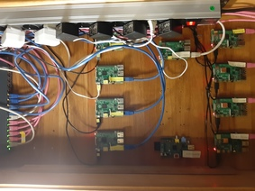

# Motivation and roadmap

Having couple of Raspberry Pi's laying around inspired me to try couple of scenarios out. Obviously everything could be tried on a standard bare metal, VM or Cloud infrastructure but playing with the RPi's forces you to think about all the aspects of running a computer - disk sizes, IOs, CPU, memory, network, power - which is just a nice learning experience.

I have always liked databases and this is a perfect opportunity to stress them to the limits where you have the physical boundaries pretty close and can see the bottlenecks. The available resources are divided between producers of data and consumers of data. Producers simply try to insert the current CPU temperature as fast as possible. Consumers of data try to accept those inserts. 

Various types of consumers are evaluated. For classical Relational Database Management Systems (RDBMS) we have MySQL. For NoSQL database we have Apache Cassandra. For stream-processing we have Apache Kafka. I would like to do some tests with Apache Flink most likely together with Kafka and Apache Beam as that would be a nice BigData setup.

That was all a nice opportunity for me to learn.

[Monitoring and benchmarking](monitoring.md)

[MySQL](mysql.md)

[Kafka](kafka.md) (WIP)

[Flink](flink.md) (WIP)

[Cassandra](cassandra.md) (WIP)

[AWS IoT](aws_iot.md)

Ideas, things I would like to try out:
- use Kafka as an intermediate step before moving the data to Cassandra/MySQL/other then I should be able to show that slow consumer of data does not bother fast producer, as Kafka acts as a buffer
- configure Kafka to store the data "since the beginning" which will allow us to build external systems for analysis like Hadoop
- try PostgreSQL
- try Scylla
